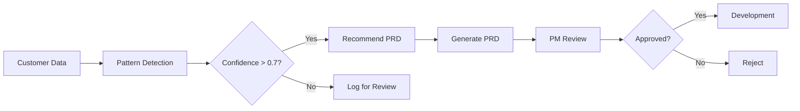

# POST /api/product-agent/analyze

Pattern detection from customer data to identify product opportunities.

## Endpoint

```
POST /api/product-agent/analyze
```

## Description

Analyzes customer data to automatically detect patterns that suggest product opportunities:
- Churn risk patterns (AR aging + support volume)
- Revenue decline signals
- Expansion opportunities
- Multi-BU consolidation needs

Saves detected patterns to database for PRD generation.

## Request

### Headers

```
Content-Type: application/json
```

### Body Schema

```typescript
{
  scope?: "full" | "incremental"        // Analysis scope (default: "full")
  businessUnit?: string                 // Filter by BU: "Cloudsense" | "Kandy" | "STL" | "all"
  analysisType?: "churn" | "expansion" | "consolidation" | "all"
  focus?: string                        // Custom focus area
}
```

### Example Requests

#### 1. Full Analysis (All Patterns)

```json
{
  "scope": "full",
  "businessUnit": "all",
  "analysisType": "all"
}
```

#### 2. Churn Risk Focus

```json
{
  "scope": "incremental",
  "businessUnit": "Cloudsense",
  "analysisType": "churn",
  "focus": "enterprise customers with payment issues"
}
```

#### 3. Expansion Opportunities

```json
{
  "businessUnit": "Kandy",
  "analysisType": "expansion"
}
```

## Response

### Success (200 OK)

```json
{
  "success": true,
  "patterns_detected": 4,
  "prds_recommended": 2,
  "total_arr_opportunity": 3450000,
  "patterns": [
    {
      "id": "pat_001",
      "patternId": "clx8k3j2k0001...",
      "name": "Enterprise AR Aging + Support Volume Spike",
      "signal": "8 enterprise customers with potential AR issues detected",
      "customers": [
        "Telstra Corporation",
        "Vodafone Netherlands",
        "British Telecommunications",
        "AT&T Services",
        "Telefonica UK",
        "Liquid Telecom",
        "Virgin Media",
        "Elisa Oyj"
      ],
      "arr_at_risk": 2800000,
      "arr_opportunity": null,
      "financial_impact": null,
      "confidence": 0.89,
      "opportunity": "Automated billing reminder system with customer self-service portal",
      "recommended_prd": true,
      "prd_title": "Automated AR Management & Customer Portal",
      "reason": "Strong signal from multiple enterprise customers"
    },
    {
      "id": "pat_002",
      "patternId": "clx8k3j2k0002...",
      "name": "Recurring Revenue Decline Pattern",
      "signal": "23 customers showing RR decline vs total revenue",
      "customers": [
        "Spotify",
        "StarHub",
        "Maxis Broadband",
        "..."
      ],
      "arr_at_risk": null,
      "arr_opportunity": null,
      "financial_impact": 650000,
      "confidence": 0.72,
      "opportunity": "Usage analytics dashboard + proactive engagement alerts",
      "recommended_prd": true,
      "prd_title": "Customer Success Early Warning System",
      "reason": "Strong signal from multiple customers"
    },
    {
      "id": "pat_003",
      "patternId": "clx8k3j2k0003...",
      "name": "High-Value Customer Expansion Opportunity",
      "signal": "5 high-value customers (>$500K ARR) could benefit from premium features",
      "customers": [
        "Telstra Corporation",
        "British Telecommunications",
        "AT&T Services",
        "Vodafone Netherlands",
        "Telefonica UK"
      ],
      "arr_at_risk": null,
      "arr_opportunity": 920000,
      "financial_impact": null,
      "confidence": 0.68,
      "opportunity": "Premium tier with advanced analytics and dedicated support",
      "recommended_prd": false,
      "reason": "Needs customer validation before PRD generation"
    },
    {
      "id": "pat_004",
      "patternId": "clx8k3j2k0004...",
      "name": "Multi-BU Customer Consolidation Requests",
      "signal": "12 customers with multiple BU relationships",
      "customers": [
        "AT&T Services",
        "British Telecommunications",
        "..."
      ],
      "arr_at_risk": null,
      "arr_opportunity": 1080000,
      "financial_impact": null,
      "confidence": 0.65,
      "opportunity": "Multi-BU consolidated view and unified billing",
      "recommended_prd": false,
      "reason": "Below confidence threshold - needs customer validation"
    }
  ]
}
```

### Error (500 Internal Server Error)

```json
{
  "error": "Analysis failed",
  "details": "Database connection timeout"
}
```

## Response Fields

| Field | Type | Description |
|-------|------|-------------|
| `success` | boolean | Analysis completion status |
| `patterns_detected` | number | Total patterns found |
| `prds_recommended` | number | Patterns meeting PRD generation threshold |
| `total_arr_opportunity` | number | Combined financial impact across all patterns |
| `patterns[].id` | string | Pattern identifier for UI |
| `patterns[].patternId` | string | Database ID (for PRD generation) |
| `patterns[].name` | string | Pattern name |
| `patterns[].signal` | string | What triggered this pattern |
| `patterns[].customers` | string[] | Affected customer names |
| `patterns[].arr_at_risk` | number\|null | ARR at risk of churn |
| `patterns[].arr_opportunity` | number\|null | ARR expansion opportunity |
| `patterns[].financial_impact` | number\|null | Other financial impact |
| `patterns[].confidence` | number | Confidence score (0-1) |
| `patterns[].opportunity` | string | Product opportunity description |
| `patterns[].recommended_prd` | boolean | Whether PRD generation is recommended |
| `patterns[].prd_title` | string | Suggested PRD title |
| `patterns[].reason` | string | Rationale for recommendation |

## Pattern Detection Logic

### 1. AR Aging + Support Volume (Churn Risk)

**Trigger**: Customers with high revenue and RR < NRR (indicates issues)

**Calculation**:
```typescript
const arAgingCustomers = customers.filter(c =>
  c.totalRevenue > 400000 && c.rr < c.nrr
)
```

**Confidence**: Base 0.85 + 0.02 per customer (max 0.95)

**PRD Recommended**: If ≥ 2 enterprise customers

---

### 2. RR Decline Pattern

**Trigger**: RR significantly lower than total revenue

**Calculation**:
```typescript
const decliningRevenue = customers.filter(c =>
  c.rr < (c.totalRevenue * 0.85)
)
```

**Confidence**: 0.72

**PRD Recommended**: If ≥ 10 customers

---

### 3. High-Value Customer Expansion

**Trigger**: Large customers in specific BU

**Calculation**:
```typescript
const highValueCustomers = customers.filter(c =>
  c.totalRevenue > 500000 && c.bu === 'Cloudsense'
)
```

**Confidence**: 0.68

**PRD Recommended**: If ≥ 2 customers (requires validation)

---

### 4. Multi-BU Customer Consolidation

**Trigger**: Customers present in multiple business units

**Calculation**:
```typescript
const multiBuCustomers = Object.entries(customersByName)
  .filter(([_, cs]) => new Set(cs.map(c => c.bu)).size > 1)
```

**Confidence**: 0.65

**PRD Recommended**: If ≥ 3 customers (requires validation)

## Usage Examples

### Example 1: Full Analysis

```javascript
const runAnalysis = async () => {
  const response = await fetch('/api/product-agent/analyze', {
    method: 'POST',
    headers: { 'Content-Type': 'application/json' },
    body: JSON.stringify({
      scope: 'full',
      businessUnit: 'all',
      analysisType: 'all'
    })
  })

  const result = await response.json()

  console.log(`Found ${result.patterns_detected} patterns`)
  console.log(`Total opportunity: $${result.total_arr_opportunity.toLocaleString()}`)

  // Filter to high-confidence patterns
  const highConfidence = result.patterns.filter(p => p.confidence > 0.8)
  console.log(`High confidence patterns: ${highConfidence.length}`)
}
```

### Example 2: Churn Risk Only

```bash
curl -X POST http://localhost:3000/api/product-agent/analyze \
  -H "Content-Type: application/json" \
  -d '{
    "businessUnit": "Cloudsense",
    "analysisType": "churn"
  }'
```

### Example 3: Pattern Pipeline

```python
import requests

# Step 1: Run analysis
analysis = requests.post(
    'http://localhost:3000/api/product-agent/analyze',
    json={'scope': 'full', 'businessUnit': 'all'}
).json()

# Step 2: Generate PRDs for recommended patterns
for pattern in analysis['patterns']:
    if pattern['recommended_prd']:
        prd_response = requests.post(
            'http://localhost:3000/api/product-agent/generate-prd',
            json={'patternId': pattern['patternId']}
        )
        print(f"Generated PRD for: {pattern['name']}")
```

## Performance

- **Small dataset (< 50 customers)**: < 500ms
- **Medium dataset (50-150 customers)**: 500ms - 1.5s
- **Large dataset (150+ customers)**: 1.5s - 3s

## Best Practices

1. **Run regularly**: Weekly or after major customer data updates
2. **Review patterns**: Not all detected patterns warrant PRDs
3. **Validate with sales**: Confirm patterns with customer-facing teams
4. **Track false positives**: Monitor pattern quality over time
5. **Adjust thresholds**: Tune confidence levels based on your business

## Workflow Integration



## Notes

- Patterns are saved to database automatically
- Each pattern gets a unique `patternId` for PRD generation
- Confidence scores are calculated using business rules (not ML models)
- Pattern detection is deterministic (same data = same patterns)
- Consider adding customer feedback loop to improve pattern quality
