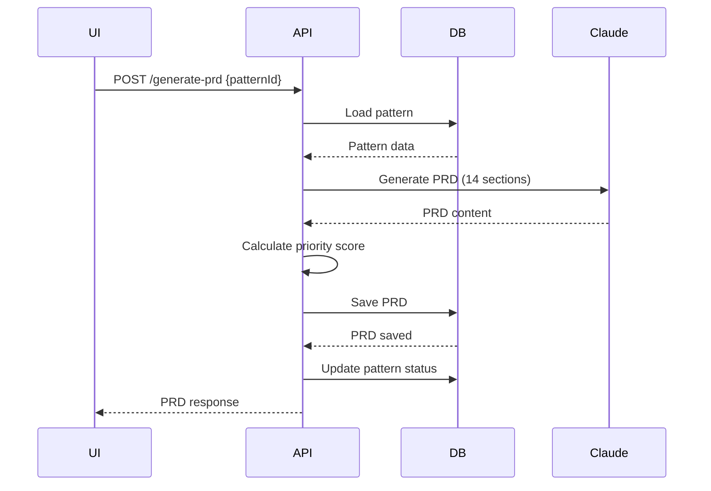

# POST /api/product-agent/generate-prd

Generate comprehensive Product Requirements Document from detected pattern.

## Endpoint

```
POST /api/product-agent/generate-prd
```

## Description

Uses Claude AI to generate a comprehensive 14-section PRD based on a detected pattern. Includes:
- Executive summary
- Strategic context
- Problem statement
- Success metrics
- User stories & JTBD
- Proposed solution
- Technical approach
- Implementation plan
- Go-to-market strategy
- Risk analysis
- Open questions
- Alternatives considered
- Success criteria
- Appendix

Automatically calculates priority score and classification using multi-factor weighted scoring.

## Request

### Headers

```
Content-Type: application/json
```

### Body Schema

```typescript
{
  patternId: string   // Pattern ID from /api/product-agent/analyze
}
```

### Example Request

```json
{
  "patternId": "clx8k3j2k0001abc..."
}
```

## Response

### Success (200 OK)

```json
{
  "success": true,
  "message": "PRD generated successfully",
  "prd": {
    "id": 1,
    "prdId": "PRD-2026-043-01",
    "title": "Automated AR Management & Customer Portal",
    "content": "# Automated AR Management & Customer Portal\n\n## 1. Executive Summary\n\n...",
    "confidenceScore": 89,
    "priorityScore": 87,
    "priorityClass": "P1",
    "leverageClassification": "Leverage",
    "arrImpact": 2800000,
    "customerCount": 8,
    "implementationWeeks": 12,
    "status": "Auto-Published",
    "workflowId": null,
    "generatedAt": "2026-02-12T10:30:00.000Z",
    "reviewedAt": null,
    "approvedAt": null,
    "shippedAt": null,
    "assignedPm": null,
    "assignedEngLead": null,
    "reviewedBy": null,
    "approvedBy": null,
    "strategicThemes": "[\"Customer Retention\",\"Operational Efficiency\",\"Self-Service\"]",
    "businessUnits": "[\"Cloudsense\",\"Kandy\",\"STL\"]",
    "customerTags": "[\"Telstra Corporation\",\"Vodafone Netherlands\",...]",
    "category": "Retention"
  }
}
```

### Success (Existing PRD)

```json
{
  "success": true,
  "message": "PRD already exists for this pattern",
  "prd": { ... }
}
```

### Error (404 Not Found)

```json
{
  "error": "Pattern not found"
}
```

### Error (500 Internal Server Error)

```json
{
  "error": "PRD generation failed",
  "details": "ANTHROPIC_API_KEY not configured"
}
```

## Response Fields

| Field | Type | Description |
|-------|------|-------------|
| `success` | boolean | Generation status |
| `message` | string | Human-readable message |
| `prd.id` | number | Database ID |
| `prd.prdId` | string | Unique PRD identifier (PRD-YYYY-DDD-NN) |
| `prd.title` | string | PRD title (max 60 chars) |
| `prd.content` | string | Full markdown content (14 sections) |
| `prd.confidenceScore` | number | Pattern confidence (0-100) |
| `prd.priorityScore` | number | Weighted priority score (0-100) |
| `prd.priorityClass` | string | P0/P1/P2/P3/P4 classification |
| `prd.leverageClassification` | string | Leverage/Neutral/Overhead |
| `prd.arrImpact` | number | Financial impact ($) |
| `prd.customerCount` | number | Number of affected customers |
| `prd.implementationWeeks` | number | Estimated implementation time |
| `prd.status` | string | Auto-Published/Pending Review/Approved/In Dev/Shipped/Rejected |
| `prd.strategicThemes` | string | JSON array of themes |
| `prd.businessUnits` | string | JSON array of BUs |
| `prd.customerTags` | string | JSON array of customer names |
| `prd.category` | string | Retention/Expansion/Efficiency/Competitive |

## PRD Structure (14 Sections)

### 1. Executive Summary
2-3 paragraphs covering problem, solution, expected outcomes

### 2. Strategic Context
Company strategy alignment, market opportunity, competitive landscape

### 3. Problem Statement
Customer pain points, current state, cost of inaction

### 4. Success Metrics
Primary metric (ARR), secondary metrics (NPS, adoption), leading indicators

### 5. User Stories & JTBD
Core workflows, Jobs-to-be-Done framework

### 6. Proposed Solution
High-level approach, key features (prioritized), UX principles

### 7. Technical Approach
Architecture, integration points, data requirements

### 8. Implementation Plan
Phases, timeline, dependencies

### 9. Go-to-Market Strategy
Target segments, pricing, launch plan

### 10. Risk Analysis
Value/usability/feasibility/viability risks with mitigation

### 11. Open Questions
Unknowns requiring validation, research needed

### 12. Alternatives Considered
Other approaches evaluated and why this was chosen

### 13. Success Criteria
Launch criteria, 30/60/90 day targets

### 14. Appendix
Supporting data, customer quotes, references

## Priority Scoring Algorithm

### Weighted Multi-Factor Scoring

```typescript
const weights = {
  arrWeight: 0.40,        // 40%
  customerWeight: 0.25,   // 25%
  confidenceWeight: 0.20, // 20%
  urgencyWeight: 0.15     // 15%
}

// ARR Score (0-100)
const arrScore = Math.min(100, (totalImpact / 5000000) * 100)

// Customer Count Score (0-100)
const customerScore = Math.min(100, (customerCount / 20) * 100)

// Confidence Score (0-100)
const confidenceScore = pattern.confidence * 100

// Urgency Score
const urgencyScore = pattern.arrAtRisk > 0 ? 100 : 60

// Final Score
const priorityScore = Math.round(
  arrScore * 0.40 +
  customerScore * 0.25 +
  confidenceScore * 0.20 +
  urgencyScore * 0.15
)
```

### Priority Classes

| Score | Class | Description |
|-------|-------|-------------|
| 90-100 | P0 | Critical - Ship this quarter |
| 80-89 | P1 | High - Next 2 quarters |
| 70-79 | P2 | Medium - Next 3-4 quarters |
| 60-69 | P3 | Low - Backlog |
| < 60 | P4 | Very Low - Consider declining |

### Leverage Classification

Based on Shreyas Doshi's LNO framework:

- **Leverage**: Score ≥ 85 AND ARR at risk > $1M (prevents churn)
- **Neutral**: Score 60-84
- **Overhead**: Score < 60 (low impact)

## PRD ID Format

```
PRD-YYYY-DDD-NN
```

- `YYYY`: Year (2026)
- `DDD`: Day of year (001-365)
- `NN`: Sequence number for that day (01-99)

**Example**: `PRD-2026-043-01` = First PRD on day 43 of 2026

## Auto-Publishing Logic

PRDs are automatically published if:
- Priority score ≥ 85
- Status set to "Auto-Published"

Otherwise:
- Status set to "Pending Review"
- Requires PM approval before development

## Usage Examples

### Example 1: Generate PRD

```javascript
const generatePRD = async (patternId) => {
  const response = await fetch('/api/product-agent/generate-prd', {
    method: 'POST',
    headers: { 'Content-Type': 'application/json' },
    body: JSON.stringify({ patternId })
  })

  const result = await response.json()

  if (result.success) {
    console.log('PRD ID:', result.prd.prdId)
    console.log('Title:', result.prd.title)
    console.log('Priority:', result.prd.priorityClass)
    console.log('Status:', result.prd.status)
    return result.prd
  }
}
```

### Example 2: Bulk PRD Generation

```bash
# Get patterns
curl -X POST http://localhost:3000/api/product-agent/analyze \
  -H "Content-Type: application/json" \
  -d '{"scope": "full"}' > patterns.json

# Extract pattern IDs and generate PRDs
cat patterns.json | jq -r '.patterns[] | select(.recommended_prd == true) | .patternId' | \
while read patternId; do
  curl -X POST http://localhost:3000/api/product-agent/generate-prd \
    -H "Content-Type: application/json" \
    -d "{\"patternId\": \"$patternId\"}"
  sleep 5  # Rate limiting
done
```

### Example 3: PRD to Markdown File

```python
import requests
import json

def generate_and_save_prd(pattern_id, output_dir='./prds'):
    response = requests.post(
        'http://localhost:3000/api/product-agent/generate-prd',
        json={'patternId': pattern_id}
    )

    result = response.json()

    if result['success']:
        prd = result['prd']
        filename = f"{output_dir}/{prd['prdId']}.md"

        with open(filename, 'w') as f:
            f.write(prd['content'])

        print(f"Saved: {filename}")
        return prd
    else:
        print(f"Error: {result.get('error')}")
        return None
```

## Performance

- **PRD generation**: 8-15 seconds (Claude API latency)
- **Database save**: < 100ms
- **Total time**: ~10-20 seconds per PRD

## Claude Model Configuration

```typescript
{
  model: 'claude-sonnet-4-20250514',
  max_tokens: 16000,    // Long-form PRD content
  messages: [{
    role: 'user',
    content: prompt     // Structured PRD prompt
  }]
}
```

## Best Practices

1. **Review before sharing**: Even auto-published PRDs should be reviewed
2. **Update estimates**: Replace AI-generated implementation weeks with engineering estimates
3. **Validate assumptions**: Confirm customer impact with sales/CS teams
4. **Track outcomes**: Update PRDLifecycle table post-launch for learning
5. **Iterate prompts**: Improve PRD quality by refining generation prompts

## Workflow Integration



## Notes

- Each pattern can only generate one PRD (idempotent)
- PRD content is stored as markdown for easy rendering
- Strategic themes and customer tags are JSON arrays stored as strings
- Priority scoring is deterministic (same pattern = same score)
- Consider adding human-in-the-loop approval for P0/P1 PRDs
- PRDLifecycle table tracks prediction accuracy for continuous improvement
