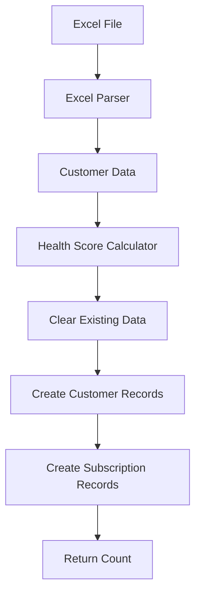

# POST /api/seed

Seed database with customer data from Excel budget file.

## Endpoint

```
POST /api/seed
```

## Description

Loads customer and subscription data from the Excel budget file (`2025-12-11 Skyvera - Budget - Q1'26 - For Todd.xlsx`) into the database. This endpoint:
- Clears existing customer and subscription data
- Parses the Excel file
- Calculates health scores
- Creates database records
- Reports seeding progress

## Request

No request body required.

### Example Request

```bash
curl -X POST http://localhost:3000/api/seed
```

## Response

### Success (200 OK)

```json
{
  "success": true,
  "message": "Seeded 140 customers successfully",
  "count": 140
}
```

### Error (500 Internal Server Error)

```json
{
  "success": false,
  "error": "Failed to load customers: Excel file not found"
}
```

## Response Fields

| Field | Type | Description |
|-------|------|-------------|
| `success` | boolean | Seeding status |
| `message` | string | Human-readable message |
| `count` | number | Number of customers seeded |
| `error` | string | Error message (if failed) |

## Data Flow



## Seeded Data Structure

### Customer Record

```typescript
{
  customerName: string
  bu: string                        // "Cloudsense" | "Kandy" | "STL"
  rr: number                        // Recurring revenue (quarterly)
  nrr: number                       // Non-recurring revenue (quarterly)
  totalRevenue: number              // rr + nrr
  rank: number | null               // Customer rank by revenue
  pctOfTotal: number | null         // Percentage of total revenue
  healthScore: string               // "Healthy" | "At Risk" | "Critical"
  subscriptions: Subscription[]     // Related subscriptions
}
```

### Subscription Record

```typescript
{
  subId: number | null              // Subscription ID
  arr: number | null                // Annual recurring revenue
  renewalQtr: string | null         // "Q1'26" | "Q2'26" | etc.
  willRenew: string | null          // "Yes" | "No" | "Unknown"
  projectedArr: number | null       // Projected ARR after renewal
}
```

## Health Score Calculation

Health scores are calculated based on multiple factors:

```typescript
function calculateHealthScore(customer: Customer): string {
  let score = 100

  // Payment behavior (-30 points for late payments)
  if (customer.arAging > 90) score -= 30

  // Revenue trend (-20 points for declining)
  if (customer.rrTrend === 'declining') score -= 20

  // Usage trend (-15 points for low usage)
  if (customer.usagePercent < 60) score -= 15

  // Support tickets (-10 points for high volume)
  if (customer.supportTickets > threshold) score -= 10

  // Engagement (-10 points for low engagement)
  if (customer.lastLogin > 30) score -= 10

  // Classification
  if (score >= 80) return 'Healthy'
  if (score >= 60) return 'At Risk'
  return 'Critical'
}
```

## Excel File Requirements

The seeding process expects the Excel file to be located at:
```
/Users/RAZER/Documents/projects/Skyvera/2025-12-11 Skyvera - Budget - Q1'26 - For Todd.xlsx
```

### Required Sheets

- **RR Summary**: Customer names, business units, recurring revenue
- **Subscription Data**: Subscription details, renewal dates, ARR

### Expected Columns

**RR Summary Sheet**:
- `Customer Name` or `Account Name`
- `BU` or `Business Unit`
- `RR Q1'26` or `Recurring Revenue`
- `NRR Q1'26` or `Non-Recurring Revenue`
- `Total Q1'26` or `Total Revenue`

**Subscription Sheet**:
- `Customer Name`
- `Subscription ID`
- `ARR`
- `Renewal Quarter`
- `Will Renew?`

## Usage Examples

### Example 1: Basic Seeding

```javascript
const seedDatabase = async () => {
  const response = await fetch('/api/seed', {
    method: 'POST'
  })

  const result = await response.json()

  if (result.success) {
    console.log(`✓ Seeded ${result.count} customers`)
  } else {
    console.error(`✗ Seeding failed: ${result.error}`)
  }
}
```

### Example 2: Seed on App Startup

```typescript
// In your Next.js app initialization
async function initializeApp() {
  // Check if database is empty
  const customerCount = await prisma.customer.count()

  if (customerCount === 0) {
    console.log('Database empty, seeding...')

    const response = await fetch('http://localhost:3000/api/seed', {
      method: 'POST'
    })

    const result = await response.json()
    console.log(result.message)
  }
}
```

### Example 3: Re-seed with Confirmation

```bash
#!/bin/bash
# reseed.sh

echo "WARNING: This will delete all existing customer data."
read -p "Are you sure? (yes/no): " confirm

if [ "$confirm" = "yes" ]; then
  echo "Seeding database..."
  curl -X POST http://localhost:3000/api/seed
  echo "\nDone!"
else
  echo "Cancelled."
fi
```

## Console Output

During seeding, the server logs progress:

```
[Seed] Loading customers from Excel...
[Seed] Found 140 customers
[Seed] Cleared existing data
[Seed] Progress: 20/140
[Seed] Progress: 40/140
[Seed] Progress: 60/140
[Seed] Progress: 80/140
[Seed] Progress: 100/140
[Seed] Progress: 120/140
[Seed] Progress: 140/140
[Seed] ✓ Seeded 140 customers to database
```

## Performance

- **Small dataset (< 50 customers)**: 1-2 seconds
- **Medium dataset (50-150 customers)**: 3-5 seconds
- **Large dataset (150+ customers)**: 5-10 seconds

Progress is logged every 20 customers.

## Data Validation

The seeding process validates:
- Customer names are unique
- Business units are valid ("Cloudsense", "Kandy", "STL")
- Revenue values are non-negative numbers
- Subscription IDs are unique per customer

Invalid records are skipped with warnings logged to console.

## Best Practices

1. **Backup before seeding**: Export existing data before re-seeding
2. **Verify Excel file**: Ensure file path and sheet names are correct
3. **Check logs**: Monitor console output for errors
4. **Test on dev first**: Seed development database before production
5. **Use transactions**: Seeding uses transaction to ensure atomicity

## Troubleshooting

### Issue: "Excel file not found"
**Solution**: Verify file path in `src/lib/data/adapters/excel/parser.ts` matches your Excel file location.

### Issue: "No customers found"
**Solution**: Check Excel sheet names and column headers match expected format.

### Issue: "Seeding stuck at X/140"
**Solution**: Check for data validation errors in console. Invalid records are skipped.

### Issue: "Database locked"
**Solution**: SQLite doesn't handle concurrent writes well. Ensure no other processes are writing to the database.

## Notes

- Seeding is **destructive** - all existing customer and subscription data is deleted
- Health scores are calculated during seeding, not stored in Excel
- Seeding is synchronous - UI will wait for completion
- Consider adding authentication for production deployments
- For continuous data sync, implement incremental updates instead of full re-seed
