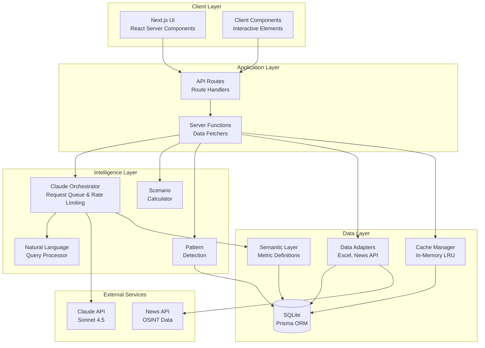
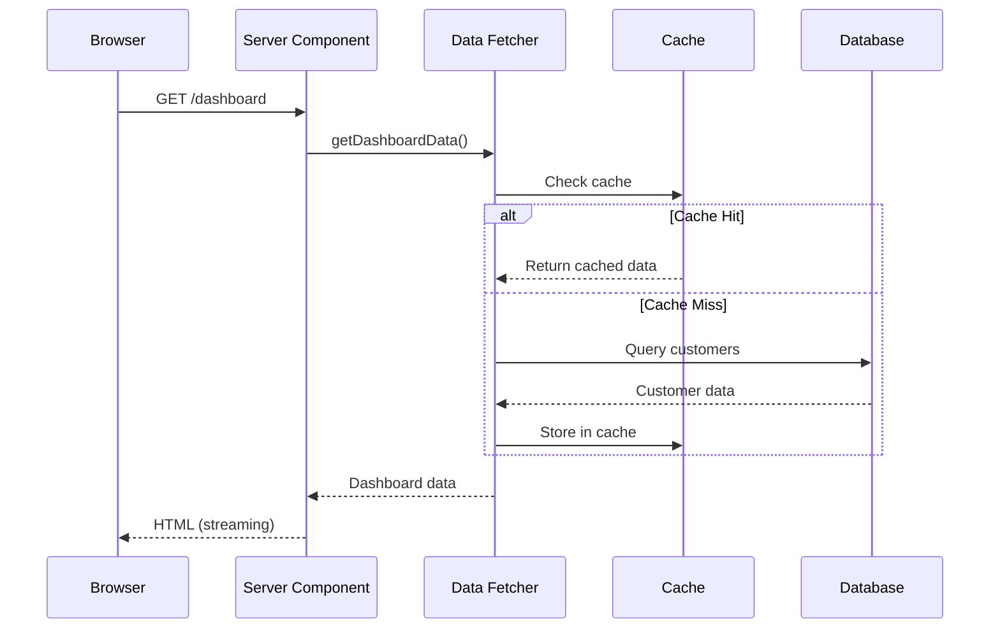
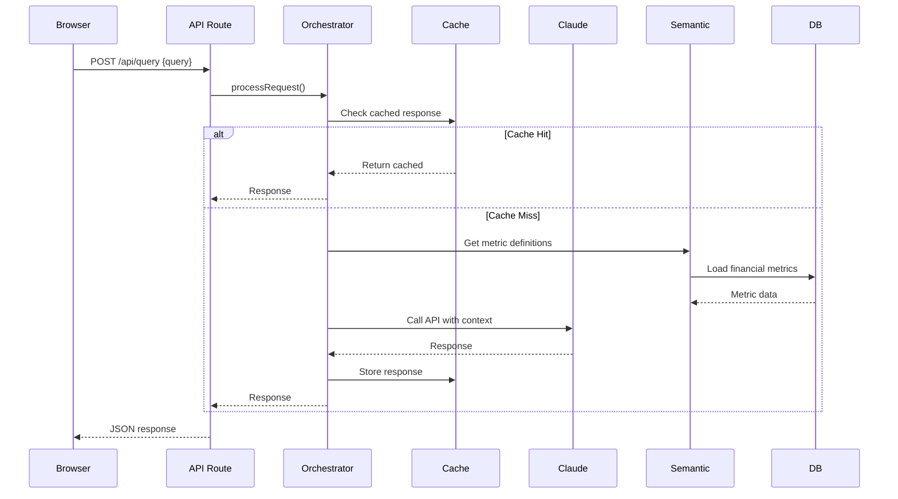
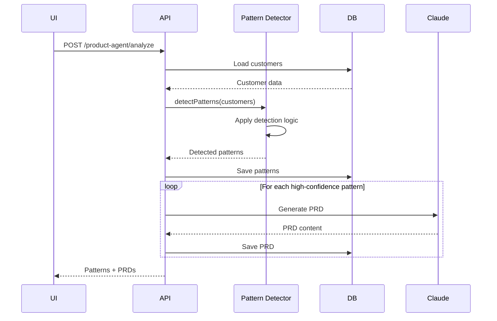

# Architecture Documentation

Comprehensive system architecture for the Skyvera Executive Intelligence System.

## Table of Contents

- [High-Level Architecture](#high-level-architecture)
- [Technology Choices](#technology-choices)
- [Data Flow](#data-flow)
- [Server vs Client Components](#server-vs-client-components)
- [Caching Strategy](#caching-strategy)
- [Claude AI Integration](#claude-ai-integration)
- [Error Handling](#error-handling)
- [Database Schema](#database-schema)
- [Security Considerations](#security-considerations)

---

## High-Level Architecture



---

## Technology Choices

### Framework: Next.js 16.1 (App Router)

**Why Next.js?**
- **Server Components**: Zero JavaScript sent to client by default
- **Server Actions**: Type-safe server functions without API routes
- **File-based routing**: Intuitive project structure
- **Built-in optimizations**: Image optimization, code splitting, font optimization
- **Streaming SSR**: Progressive rendering for faster perceived performance

**App Router Benefits:**
- Layouts and templates for shared UI
- Loading states with `loading.tsx`
- Error boundaries with `error.tsx`
- Parallel and intercepting routes

### Language: TypeScript 5.9

**Why TypeScript?**
- **Type safety**: Catch errors at compile time
- **IDE support**: Better autocomplete and refactoring
- **Zod integration**: Runtime validation + compile-time types
- **Prisma synergy**: Type-safe database queries
- **Maintainability**: Self-documenting code

### Database: Prisma + SQLite

**Why Prisma?**
- **Type-safe queries**: Generated types from schema
- **Migration system**: Version-controlled schema changes
- **Multi-database support**: Easy switch from SQLite to PostgreSQL/Turso
- **Relation management**: Automatic JOIN handling
- **Developer experience**: Excellent CLI and studio

**Why SQLite (Development)?**
- **Zero configuration**: File-based database
- **Fast development**: No server setup
- **Easy backups**: Copy the `.db` file
- **Production path**: Migrate to Turso (hosted SQLite) or PostgreSQL

### AI: Anthropic Claude Sonnet 4.5

**Why Claude?**
- **Long context**: 200K token window for complex queries
- **Structured outputs**: JSON formatting for API responses
- **Business reasoning**: Excellent at financial analysis
- **Safety**: Built-in harmlessness training
- **Rate limits**: 60 req/min on tier 1 (manageable with orchestrator)

### Styling: Tailwind CSS 4.1

**Why Tailwind?**
- **Utility-first**: Fast prototyping
- **Custom design system**: Easy theme customization
- **Zero runtime**: Purged CSS for production
- **Responsive**: Mobile-first breakpoints
- **Dark mode**: Built-in support (not yet implemented)

---

## Data Flow

### Read Path (Dashboard Query)



### Write Path (Natural Language Query)



### Pattern Detection Flow



---

## Server vs Client Components

### Server Components (Default)

**Used for:**
- Data fetching
- Database queries
- Sensitive operations (API keys)
- Heavy computations
- SEO-critical content

**Example:**
```typescript
// src/app/dashboard/page.tsx
export default async function DashboardPage() {
  const data = await getDashboardData() // Runs on server
  return <DashboardContent data={data} />
}
```

**Benefits:**
- Zero JavaScript to client
- Direct database access
- Secrets stay on server
- Automatic code splitting

### Client Components

**Used for:**
- Interactivity (onClick, onChange)
- Browser APIs (localStorage, geolocation)
- React hooks (useState, useEffect)
- Third-party libraries requiring window

**Example:**
```typescript
'use client'

export function QueryInput() {
  const [query, setQuery] = useState('')

  return (
    <input
      value={query}
      onChange={(e) => setQuery(e.target.value)}
    />
  )
}
```

**Guidelines:**
- Mark with `'use client'` directive
- Keep as small as possible
- Lift state up when needed
- Prefer Server Actions over client-side API calls

---

## Caching Strategy

### Multi-Layer Caching

```
┌─────────────────────────────────────────────┐
│          Browser Cache (HTTP)                │
│  - Static assets: Forever (immutable)        │
│  - API responses: No-cache (dynamic)         │
└─────────────────────────────────────────────┘
                    ↓
┌─────────────────────────────────────────────┐
│      Application Cache (In-Memory LRU)       │
│  - Claude responses: 15 min                  │
│  - Dashboard data: 5 min                     │
│  - Customer lists: 10 min                    │
│  - Max size: 1000 entries                    │
└─────────────────────────────────────────────┘
                    ↓
┌─────────────────────────────────────────────┐
│          Database (SQLite/Turso)             │
│  - Source of truth                           │
│  - Indexed queries                           │
└─────────────────────────────────────────────┘
```

### Cache Manager Implementation

```typescript
class CacheManager {
  private cache: LRUCache<string, any>

  set(key: string, value: any, options: { ttl: number }) {
    this.cache.set(key, {
      value,
      expiresAt: Date.now() + options.ttl
    })
  }

  get(key: string): any | null {
    const entry = this.cache.get(key)
    if (!entry) return null
    if (Date.now() > entry.expiresAt) {
      this.cache.delete(key)
      return null
    }
    return entry.value
  }
}
```

### Cache Keys

```typescript
// Pattern: entity:identifier:filters
const cacheKeys = {
  dashboard: `dashboard:all:${JSON.stringify(filters)}`,
  customer: `customer:${name}`,
  query: `claude:${hashPrompt(query)}`,
  scenario: `scenario:${scenarioType}:${hash(assumptions)}`
}
```

### Cache Invalidation

**Triggers:**
- Customer data updated: Clear `customer:*` keys
- Dashboard refresh: Clear `dashboard:*` keys
- Scenario changes: Clear `scenario:*` keys
- Time-based: TTL expiration

**Manual invalidation:**
```typescript
cacheManager.clear() // Clear all
cacheManager.delete('customer:Telstra') // Clear specific
```

---

## Claude AI Integration

### Orchestrator Architecture

```typescript
class ClaudeOrchestrator {
  private queue: QueuedRequest[]
  private rateLimiter: RateLimiter
  private cache: CacheManager

  async processRequest(request: ClaudeRequest): Promise<Result> {
    // 1. Check cache
    const cached = this.cache.get(request.cacheKey)
    if (cached) return ok(cached)

    // 2. Add to priority queue
    await this.enqueueRequest(request)

    // 3. Process queue with rate limiting
    await this.processQueue()

    // 4. Cache response
    this.cache.set(request.cacheKey, response)

    return ok(response)
  }
}
```

### Request Priority

```typescript
enum Priority {
  HIGH = 0,    // User-facing queries (return in < 3s)
  MEDIUM = 1,  // Dashboard enrichment (< 10s)
  LOW = 2      // Background processing (< 30s)
}
```

### Rate Limiting

```typescript
class ClaudeRateLimiter {
  private requests: number[] = []
  private maxRequests = 60 // per minute

  async waitForSlot(): Promise<void> {
    const now = Date.now()
    const oneMinuteAgo = now - 60000

    // Remove old requests
    this.requests = this.requests.filter(t => t > oneMinuteAgo)

    if (this.requests.length >= this.maxRequests) {
      const oldestRequest = this.requests[0]
      const waitTime = oldestRequest + 60000 - now
      await sleep(waitTime)
    }

    this.requests.push(now)
  }
}
```

### Retry Logic

```typescript
async function callWithRetry<T>(
  fn: () => Promise<T>,
  maxRetries = 3
): Promise<Result<T>> {
  for (let attempt = 0; attempt <= maxRetries; attempt++) {
    try {
      const result = await fn()
      return ok(result)
    } catch (error) {
      if (error.status === 429 && attempt < maxRetries) {
        // Exponential backoff: 1s, 2s, 4s
        const delay = 1000 * Math.pow(2, attempt)
        await sleep(delay)
        continue
      }
      return err(error)
    }
  }
}
```

### Semantic Context Injection

```typescript
const systemPrompt = `
You are a financial analyst for Skyvera, a B2B SaaS portfolio company.

## Business Context
- Total Revenue: $14.7M quarterly
- Business Units: Cloudsense ($8M), Kandy ($3.3M), STL ($1M)
- Customer Count: 140 enterprise accounts
- Target Net Margin: 68.7% (current: 62.5%)

## Financial Metrics
- RR: Recurring Revenue (subscription)
- ARR: Annual Recurring Revenue (RR × 4)
- NRR: Non-Recurring Revenue (one-time)
- EBITDA: Earnings before interest, taxes, depreciation, amortization

${semanticLayer.getMetricDefinitions()}
`
```

---

## Error Handling

### Result Type Pattern

```typescript
type Result<T> =
  | { success: true; value: T }
  | { success: false; error: Error }

// Usage
const result = await fetchCustomers()
if (!result.success) {
  return handleError(result.error)
}
const customers = result.value
```

**Benefits:**
- **Type-safe**: Compiler forces error handling
- **Explicit**: No hidden throws
- **Composable**: Chain operations safely

### Error Boundaries

```typescript
// src/app/error.tsx
'use client'

export default function Error({
  error,
  reset
}: {
  error: Error
  reset: () => void
}) {
  return (
    <div>
      <h2>Something went wrong</h2>
      <button onClick={reset}>Try again</button>
    </div>
  )
}
```

### API Error Responses

```typescript
// Consistent error format
{
  error: string,          // Error type
  message: string,        // Human-readable
  details?: any,          // Additional context
  timestamp: string       // ISO 8601
}
```

### Error Logging

```typescript
function logError(error: Error, context: Record<string, unknown>) {
  console.error('[ERROR]', {
    message: error.message,
    stack: error.stack,
    context,
    timestamp: new Date().toISOString()
  })

  // In production: Send to Sentry, Datadog, etc.
  if (process.env.NODE_ENV === 'production') {
    Sentry.captureException(error, { extra: context })
  }
}
```

---

## Database Schema

### Core Entities

```mermaid
erDiagram
    Customer ||--o{ Subscription : has
    Customer {
        int id PK
        string customerName UK
        string bu
        float rr
        float nrr
        float totalRevenue
        int rank
        string healthScore
    }

    Subscription {
        int id PK
        int customerId FK
        float arr
        string renewalQtr
        string willRenew
        float projectedArr
    }

    FinancialSnapshot {
        int id PK
        string bu
        string quarter
        float totalRR
        float totalNRR
        float ebitda
    }

    NewsArticle {
        int id PK
        string customerName
        string title
        string summary
        datetime publishedAt
        string sentiment
    }

    Pattern ||--o| PRD : generates
    Pattern {
        int id PK
        string patternId UK
        string name
        string description
        float confidence
        string customers JSON
        float arrAtRisk
        string status
    }

    PRD ||--o| PRDLifecycle : tracks
    PRD {
        int id PK
        string prdId UK
        string title
        string content
        int priorityScore
        string priorityClass
        float arrImpact
        string status
    }

    PRD ||--o{ FeatureRequest : linked_to
    FeatureRequest {
        int id PK
        string customerName
        string featureDescription
        string urgency
        string status
        string linkedPrdId FK
    }

    PRDLifecycle {
        int id PK
        string prdId FK
        float predictedArrImpact
        float actualArrImpact30d
        float predictionAccuracy
    }
```

### Indexes

```prisma
@@index([bu])
@@index([customerName])
@@index([healthScore])
@@index([publishedAt])
@@index([status])
@@index([priorityClass])
```

**Why these indexes?**
- `bu`: Business unit filtering (common query)
- `customerName`: Account lookups (exact match)
- `healthScore`: At-risk customer queries
- `publishedAt`: Recent news sorting
- `status`: PRD workflow filtering
- `priorityClass`: P0/P1 PRD queries

---

## Security Considerations

### API Key Management

```typescript
// ❌ DON'T: Expose in client code
const apiKey = 'sk-ant-...'

// ✅ DO: Keep on server
const apiKey = process.env.ANTHROPIC_API_KEY
```

### Environment Variables

```bash
# .env.local (gitignored)
ANTHROPIC_API_KEY=sk-ant-...
NEWSAPI_KEY=...
DATABASE_URL=file:./dev.db
```

### Input Validation

```typescript
import { z } from 'zod'

const querySchema = z.object({
  query: z.string().min(3).max(500),
  filters: z.object({
    bu: z.enum(['Cloudsense', 'Kandy', 'STL']).optional()
  }).optional()
})

// Validate before processing
const validation = querySchema.safeParse(body)
if (!validation.success) {
  return error(400, validation.error)
}
```

### SQL Injection Prevention

```typescript
// ❌ DON'T: String concatenation
await prisma.$queryRaw(`SELECT * FROM customers WHERE name = '${name}'`)

// ✅ DO: Parameterized queries
await prisma.customer.findMany({
  where: { customerName: name }
})
```

### Production Hardening Checklist

- [ ] Add authentication (OAuth, JWT, API keys)
- [ ] Implement rate limiting per user/IP
- [ ] Enable CORS with whitelist
- [ ] Use HTTPS only (enforce in production)
- [ ] Sanitize user inputs
- [ ] Add request logging
- [ ] Implement CSRF protection
- [ ] Use helmet.js for security headers
- [ ] Enable database connection pooling
- [ ] Set up monitoring and alerts

---

## Performance Optimizations

### Database

1. **Indexes**: Added on frequently queried columns
2. **Connection pooling**: Reuse database connections
3. **Pagination**: Limit query results (e.g., top 20 customers)
4. **Selective loading**: Use Prisma's `select` and `include`

### Caching

1. **LRU eviction**: Remove least recently used entries
2. **TTL-based**: Automatic expiration
3. **Stale-while-revalidate**: Return cached while fetching fresh

### Next.js

1. **Server Components**: Zero client JavaScript
2. **Streaming**: Progressive rendering
3. **Image optimization**: Automatic WebP conversion
4. **Code splitting**: Per-route bundles

---

## Deployment Architecture

### Development

```
┌─────────────────┐
│   Developer     │
│   localhost:3000│
│                 │
│ - SQLite local  │
│ - Hot reload    │
│ - Debug logs    │
└─────────────────┘
```

### Production

```
┌──────────────────────────────────────────┐
│              Vercel Edge                 │
│  - CDN (static assets)                   │
│  - Serverless Functions (API routes)     │
│  - Edge Functions (middleware)           │
└──────────────────────────────────────────┘
            ↓                ↓
┌─────────────────┐  ┌─────────────────────┐
│  Turso/Neon     │  │  Anthropic API      │
│  (Database)     │  │  (Claude AI)        │
└─────────────────┘  └─────────────────────┘
```

---

## Monitoring & Observability

### Metrics to Track

1. **Performance**
   - API response times (p50, p95, p99)
   - Database query times
   - Claude API latency
   - Cache hit rate

2. **Business**
   - Daily active users
   - Queries per user
   - Top queried metrics
   - PRDs generated per week

3. **Errors**
   - 5xx error rate
   - Failed Claude API calls
   - Database connection errors
   - Rate limit violations

### Logging Strategy

```typescript
// Structured logging
logger.info('Query processed', {
  userId: user.id,
  query: query.substring(0, 100),
  latency: endTime - startTime,
  cached: result.cached,
  timestamp: new Date().toISOString()
})
```

---

## Future Architecture Considerations

### Scalability

- **Multi-tenancy**: Support multiple Skyvera-like companies
- **Read replicas**: Separate read/write databases
- **Sharding**: Partition by business unit
- **Microservices**: Split pattern detection, PRD generation into separate services

### Real-time Features

- **WebSockets**: Live dashboard updates
- **Server-Sent Events**: Streaming PRD generation
- **Webhooks**: Notify on critical alerts

### Advanced Features

- **Recommendation engine**: ML-based customer health prediction
- **Anomaly detection**: Automatic outlier identification
- **Forecasting**: Time-series prediction for revenue
- **A/B testing**: Experiment framework for features
