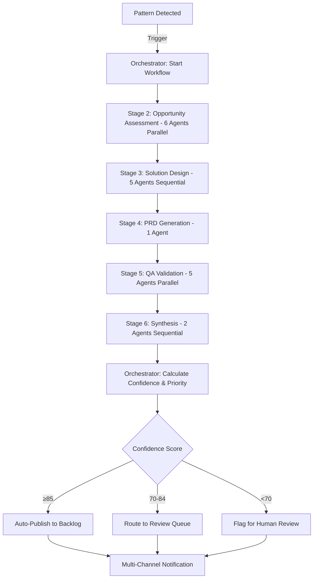

# Product Agent System - Comprehensive Design Document

**Project:** Skyvera Business Intelligence Platform
**Document Type:** Technical Design & Architecture
**Version:** 1.0
**Date:** 2026-02-09
**Status:** Approved for Implementation

---

## Executive Summary

This document specifies a world-class AI-powered product management system that automatically identifies product needs, generates comprehensive PRD documents, and prioritizes work for sales and engineering teams. The system employs 20 specialized AI agents working in orchestrated workflows to deliver product intelligence that rivals the top 3 product managers in the world.

**Key Capabilities:**
- **Automatic Pattern Detection**: Continuously monitors customer behavior, financial data, competitive landscape, and market signals to identify product opportunities
- **Comprehensive PRD Generation**: Creates outcome-driven product requirements documents in 15-20 minutes with business case, customer evidence, ROI models, competitive analysis, and go-to-market strategy
- **Intelligent Prioritization**: Weighted multi-factor scoring (ARR impact 40%, customer reach 25%, competitive urgency 20%, implementation feasibility 15%) with Shreyas Doshi's Leverage/Neutral/Overhead classification
- **Multi-Channel Delivery**: Surfaces product intelligence across Product Backlog, Account Plans, Alert System, and Executive Dashboard
- **Continuous Learning**: Tracks outcomes and improves predictions over time through feedback loops
- **Multi-Project Architecture**: Designed to work across multiple projects/companies with tenant isolation and shared learnings

**Business Outcomes:**
- **$10M+ ARR opportunity identification** annually through pattern detection
- **$2M+ churn prevention** by identifying at-risk customers early
- **500+ hours PM time saved** annually vs manual PRD writing
- **20% sales cycle reduction** through faster feature prioritization
- **30+ days competitive advantage** by detecting opportunities before competitors

**Timeline:** 16 weeks to production-ready system

---

## Table of Contents

1. [Background & Objectives](#1-background--objectives)
2. [Research Foundation](#2-research-foundation)
3. [System Architecture](#3-system-architecture)
4. [Multi-Agent Design](#4-multi-agent-design)
5. [Workflow & Orchestration](#5-workflow--orchestration)
6. [PRD Structure](#6-prd-structure)
7. [Prioritization System](#7-prioritization-system)
8. [Data Sources & Integration](#8-data-sources--integration)
9. [Feedback Loop Learning](#9-feedback-loop-learning)
10. [Multi-Channel Delivery](#10-multi-channel-delivery)
11. [Multi-Project Architecture](#11-multi-project-architecture)
12. [Security & Compliance](#12-security--compliance)
13. [Infrastructure](#13-infrastructure)
14. [Implementation Roadmap](#14-implementation-roadmap)
15. [Success Metrics](#15-success-metrics)
16. [Appendices](#16-appendices)

---

## 1. Background & Objectives

### 1.1 Problem Statement

Product teams face critical challenges:
- **Reactive, not proactive**: Product managers spend time reacting to requests instead of identifying opportunities
- **Fragmented signals**: Customer feedback scattered across Salesforce, support tickets, sales calls, usage data
- **Inconsistent prioritization**: Subjective decisions without rigorous ROI analysis
- **Slow PRD creation**: Manual PRD writing takes days or weeks, blocking development
- **Limited competitive intelligence**: Miss market movements and competitor launches
- **No learning loop**: Same mistakes repeated, no systematic improvement

**Cost to Business:**
- Missed $10M+ ARR opportunities annually
- $2-3M churn due to unaddressed feature gaps
- 500+ PM hours wasted on manual analysis
- Slower time-to-market vs competitors

### 1.2 Vision

Build a **world-class product intelligence system** powered by 20 specialized AI agents that:
1. **Automatically detects** product opportunities from multi-source data
2. **Generates comprehensive PRDs** in 15-20 minutes with business rigor
3. **Prioritizes work** using data-driven scoring algorithms
4. **Surfaces intelligence** across all stakeholder touchpoints
5. **Continuously learns** from outcomes to improve predictions
6. **Works across multiple projects** with tenant isolation

The system should operate at the level of **top 3 product managers in the world** (Shreyas Doshi, Marty Cagan, Lenny Rachitsky caliber).

### 1.3 Success Criteria

**Quantitative:**
- PRD approval rate >85% without major revision
- Prediction accuracy ±20% for ARR impact
- Time to PRD <20 minutes (95th percentile)
- $10M+ ARR opportunity identified annually
- Agent confidence calibration within ±5%

**Qualitative:**
- Sales team adopts account plan feature requests
- Executives read and act on weekly summaries
- Product managers trust agent recommendations
- Engineering teams find PRDs actionable
- Board members reference agent insights

### 1.4 Constraints & Requirements

**Non-Negotiable:**
- Security: Standard SaaS security + customer data isolation + enterprise compliance (SOC2/GDPR/CCPA)
- Quality: Comprehensive + sales-focused PRDs with clear ROI and retention impact
- Speed: Accuracy and speed prioritized over cost optimization
- Learning: Feedback loops required for continuous improvement
- Multi-tenant: Support multiple projects with data isolation

**Technology Preferences:**
- TypeScript/Next.js for application layer
- PostgreSQL for transactional data
- Redis for caching and real-time state
- Anthropic Claude Opus for strategic reasoning
- OpenAI GPT-4 for supplemental analysis
- Perplexity for market research
- Local models (Llama 3) for high-frequency tasks

---

## 2. Research Foundation

This design synthesizes best practices from world-class product management thought leaders.

### 2.1 Shreyas Doshi - Strategic Frameworks

**Source:** [Good Product Managers, Great Product Managers](https://shreyasdoshi.com/good-product-managers-great-product-managers/)

**Key Frameworks:**
- **LNO Framework**: Classify work as Leverage (high impact, reasonable effort), Neutral (moderate), or Overhead (low value, high effort). Focus on Leverage tasks.
- **Three Levels of Product Work**: Impact level (outcomes), Execution level (how), Optics level (perception). Ensure alignment across levels.
- **BTD Framework**: Below/To/Differentiate - understand competitive positioning before building
- **Insight-Execution-Impact**: Evaluate PMs on quality of insights, execution excellence, and business impact

**Application to Agent System:**
- Validation Agent classifies every PRD as Leverage/Neutral/Overhead
- Prioritization algorithm penalizes Overhead tasks
- PRD structure separates strategic impact from execution details
- Impact Measurement Agent tracks all three dimensions

### 2.2 Marty Cagan - Continuous Discovery

**Source:** [Product Discovery - Silicon Valley Product Group](https://www.svpg.com/product-discovery/)

**Key Concepts:**
- **Four Key Risks**: Value (will customers buy?), Usability (can they use it?), Feasibility (can we build?), Business Viability (does it work for the business?)
- **Continuous Discovery**: Research and validate ideas continuously during delivery, not just upfront
- **Discovery Techniques**: Framing, planning, ideation, prototyping, testing in parallel with delivery

**Application to Agent System:**
- Discovery Agent implements four-risk framework in every PRD
- Pattern Detection runs continuously (not batch)
- PRD includes validation plan with experiments to test assumptions
- Real-time event triggers enable continuous discovery

### 2.3 Lenny Rachitsky - ROI-Driven Prioritization

**Source:** [Prioritizing - Lenny's Newsletter](https://www.lennysnewsletter.com/p/prioritizing)

**Key Framework:**
- **Three-Factor Prioritization**: (1) Expected impact, (2) Resources necessary, (3) Risk
- **Sort by ROI**: Impact divided by effort
- **Ruthless Prioritization**: Focus on tasks with highest business value

**Application to Agent System:**
- Priority score = (Impact factors × 65%) - (Effort/Risk × 35%)
- ARR impact is primary impact metric (40% weight)
- Implementation feasibility inversely weighted (easier = higher priority)
- Financial Modeling Agent calculates ROI with confidence intervals

### 2.4 Teresa Torres - Opportunity Solution Trees

**Source:** [Opportunity Solution Trees - Product Talk](https://www.producttalk.org/opportunity-solution-trees/)

**Key Framework:**
- **Tree Structure**: Outcome (top) → Opportunities (customer needs) → Solutions (how to address) → Experiments (validation)
- **Continuous Discovery Habits**: Weekly touchpoints with customers, document decisions, visualize thinking
- **Evidence-Based**: Connect every solution to customer evidence

**Application to Agent System:**
- Discovery Agent creates OST for every PRD
- Customer Voice Agent provides evidence at opportunity level
- PRD includes experiments to validate before full build
- Visual OST in PRD document

### 2.5 Enterprise B2B SaaS Best Practices

**Source:** [The Ultimate PRD Guide for B2B SaaS Success](https://www.codelevate.com/blog/the-ultimate-prd-guide-for-your-b2b-saas-success-in-2025)

**Key Practices:**
- **Outcome-Driven**: Focus on business outcomes, not features ("your team never loses a day to outages" vs "99.99% SLA")
- **ROI Quantification**: Translate value into dollars saved or revenue generated
- **Messaging Hierarchy**: Who it's for, problem they face, value delivered, proof points
- **Technical + Business Documentation**: Detailed specs for engineers, ROI summaries for executives

**Application to Agent System:**
- PRD Writer Agent trained on outcome-driven language
- Financial Modeling Agent quantifies value in dollar terms
- Storytelling Agent creates executive narratives
- PRD includes both technical approach and business case

---

## 3. System Architecture

### 3.1 High-Level Architecture

```
┌─────────────────────────────────────────────────────────────────┐
│                     User Interface Layer                         │
│  ┌──────────────┐  ┌──────────────┐  ┌──────────────┐          │
│  │   Product    │  │   Account    │  │    Alert     │          │
│  │   Backlog    │  │    Plans     │  │   System     │          │
│  └──────────────┘  └──────────────┘  └──────────────┘          │
│         │                  │                  │                  │
└─────────┼──────────────────┼──────────────────┼─────────────────┘
          │                  │                  │
          └──────────────────┼──────────────────┘
                             ▼
┌─────────────────────────────────────────────────────────────────┐
│                   API Gateway & Routing Layer                    │
│           (Next.js API Routes + Vercel Edge Functions)           │
└─────────────────────────────────────────────────────────────────┘
                             │
          ┌──────────────────┼──────────────────┐
          ▼                  ▼                  ▼
┌──────────────────┐  ┌──────────────┐  ┌──────────────────┐
│  Data Access     │  │   Message    │  │  External APIs   │
│  Layer (Prisma)  │  │   Queue      │  │  (Salesforce,    │
│                  │  │  (Inngest)   │  │   Zendesk, etc)  │
└──────────────────┘  └──────────────┘  └──────────────────┘
          │                  │                  │
          ▼                  ▼                  ▼
┌─────────────────────────────────────────────────────────────────┐
│                    Agent Orchestration Layer                     │
│                                                                   │
│  ┌────────────────────────────────────────────────────────┐    │
│  │              Orchestrator Agent                         │    │
│  │  (Workflow State Machine, Job Coordination, Routing)    │    │
│  └────────────────────────────────────────────────────────┘    │
│                                                                   │
│  Stage 1: Signal Detection (Continuous)                          │
│  ┌──────────────┐  ┌──────────────┐  ┌──────────────┐          │
│  │   Pattern    │  │ Competitive  │  │  Customer    │          │
│  │  Detection   │  │ Intelligence │  │    Voice     │          │
│  └──────────────┘  └──────────────┘  └──────────────┘          │
│                                                                   │
│  Stage 2: Opportunity Assessment (Parallel)                      │
│  ┌──────────────┐  ┌──────────────┐  ┌──────────────┐          │
│  │  Discovery   │  │   Research   │  │ Data Science │          │
│  └──────────────┘  └──────────────┘  └──────────────┘          │
│  ┌──────────────┐  ┌──────────────┐                             │
│  │  Strategic   │  │  Customer    │                             │
│  │  Alignment   │  │    Voice     │                             │
│  └──────────────┘  └──────────────┘                             │
│                                                                   │
│  Stage 3: Solution Design (Sequential)                           │
│  ┌──────────────┐  ┌──────────────┐  ┌──────────────┐          │
│  │ Engineering  │  │   Design     │  │  Financial   │          │
│  │ Feasibility  │  │  Thinking    │  │  Modeling    │          │
│  └──────────────┘  └──────────────┘  └──────────────┘          │
│  ┌──────────────┐                                                │
│  │     GTM      │                                                │
│  └──────────────┘                                                │
│                                                                   │
│  Stage 4: PRD Generation (Single)                                │
│  ┌──────────────────────────────────────────────────┐           │
│  │           PRD Writer Agent (Claude Opus)          │           │
│  └──────────────────────────────────────────────────┘           │
│                                                                   │
│  Stage 5: QA Validation (Parallel)                               │
│  ┌──────────────┐  ┌──────────────┐  ┌──────────────┐          │
│  │  Validation  │  │     Risk     │  │   Ethics &   │          │
│  │              │  │  Assessment  │  │     Bias     │          │
│  └──────────────┘  └──────────────┘  └──────────────┘          │
│  ┌──────────────┐  ┌──────────────┐                             │
│  │    Legal &   │  │    Impact    │                             │
│  │  Compliance  │  │ Measurement  │                             │
│  └──────────────┘  └──────────────┘                             │
│                                                                   │
│  Stage 6: Synthesis (Sequential)                                 │
│  ┌──────────────┐  ┌──────────────┐                             │
│  │ Storytelling │  │  Synthesis   │                             │
│  └──────────────┘  └──────────────┘                             │
│                                                                   │
│  Stage 7: Post-Launch Learning (Async)                           │
│  ┌──────────────────────────────────────────────────┐           │
│  │        Impact Measurement Agent                   │           │
│  └──────────────────────────────────────────────────┘           │
└─────────────────────────────────────────────────────────────────┘
                             │
          ┌──────────────────┼──────────────────┐
          ▼                  ▼                  ▼
┌──────────────────┐  ┌──────────────┐  ┌──────────────────┐
│   PostgreSQL     │  │    Redis     │  │   Snowflake      │
│  (Transactional) │  │   (Cache)    │  │  (Analytics)     │
└──────────────────┘  └──────────────┘  └──────────────────┘
```

### 3.2 Technology Stack

**Application Layer:**
- Next.js 14+ (React Server Components)
- TypeScript (strict mode)
- Tailwind CSS for styling
- Prisma ORM for database access

**Agent Infrastructure:**
- Node.js worker cluster (Railway/AWS ECS Fargate)
- Inngest for workflow orchestration
- BullMQ for job queue
- Redis for agent state management

**Data Layer:**
- PostgreSQL 16 (primary database)
- Redis Enterprise (cache + real-time state)
- Snowflake (data warehouse)
- Pinecone (vector database for semantic search)

**AI/ML:**
- Anthropic Claude Opus (strategic reasoning, PRD generation)
- OpenAI GPT-4 Turbo (supplemental analysis)
- Perplexity API (market research)
- Llama 3 70B (local model for high-frequency tasks)
- OpenAI Embeddings (semantic search)

**External Integrations:**
- Salesforce (CRM data)
- Zendesk/Intercom (support tickets)
- Amplitude/Mixpanel (product analytics)
- Gainsight (customer success)
- NetSuite/QuickBooks (financial data)

**Infrastructure:**
- Vercel (Next.js hosting)
- AWS RDS (PostgreSQL)
- AWS S3 (file storage)
- Railway (agent workers)
- Datadog (monitoring)

---

## 4. Multi-Agent Design

### 4.1 Agent Architecture Principles

**Specialization over Generalization:**
Each agent excels at a specific domain rather than trying to do everything. This mirrors how elite product teams organize (product manager, researcher, data scientist, engineer, designer).

**Stateless Agents:**
Agents are stateless functions. All state stored in Redis/PostgreSQL. Enables horizontal scaling and fault tolerance.

**Clear Interfaces:**
Every agent has well-defined inputs and outputs. Enables independent development, testing, and optimization.

**Composability:**
Agents can be composed into workflows. Orchestrator manages dependencies and handoffs.

### 4.2 Agent Catalog (20 Agents)

#### Signal Detection Agents (Continuous Background)

**1. Pattern Detection Agent**
- **Purpose**: Continuously monitors data streams to identify behavioral patterns indicating product opportunities
- **Data Sources**: Customer financial data, health scores, feature requests, churn indicators
- **AI Model**: Llama 3 70B (local, high-frequency)
- **Output**: Pattern detected events with confidence scores
- **Triggers**:
  - 3+ customers request similar feature within 30 days
  - Customer health score drops + support tickets spike
  - AR aging increases + contract renewal approaching
  - Multiple customers mention same competitor
- **Frequency**: Every 15 minutes
- **False Positive Rate Target**: <15%

**2. Competitive Intelligence Agent**
- **Purpose**: Monitors competitive landscape via OSINT to detect threats and opportunities
- **Data Sources**: Competitor websites, G2/Capterra reviews, job postings, GitHub, news, patents
- **Tools**: Playwright (web scraping), Bright Data (proxies), Perplexity API
- **Output**: Competitive intelligence reports with change detection
- **Triggers**:
  - Competitor product page changes
  - New competitor feature announced
  - Customer review mentions competitor advantage
  - Job posting reveals roadmap hints
- **Frequency**: Daily batch + real-time for major announcements
- **Compliance**: Respects robots.txt, rate limits, ethical scraping practices

**3. Customer Voice Agent**
- **Purpose**: Synthesizes customer feedback from all sources into actionable intelligence
- **Data Sources**: Manual sales input forms, support tickets, call transcripts, CRM notes
- **AI Model**: OpenAI GPT-4 Turbo
- **Output**: Structured customer feedback with quotes, urgency, deal impact
- **Key Functions**:
  - Extract verbatim customer quotes
  - Identify jobs-to-be-done
  - Assess deal impact (hard blocker, soft blocker, friction, nice-to-have)
  - Calculate ARR impact from affected customers
  - Cluster similar requests across customers
- **Frequency**: Real-time + batch clustering hourly

#### Opportunity Assessment Agents (Parallel Stage)

**4. Discovery Agent**
- **Purpose**: Creates Opportunity Solution Trees and validates customer problems
- **Framework**: Teresa Torres OST + Marty Cagan four-risk framework
- **AI Model**: Claude Opus
- **Output**: Opportunity Solution Tree, problem validation, solution options, experiments
- **Key Functions**:
  - Map outcome → opportunities → solutions → experiments
  - Assess value, usability, feasibility, viability risks
  - Validate opportunity size (TAM/SAM/SOM)
  - Recommend experiments to test hypotheses
- **Execution Time**: 3-5 minutes

**5. Research Agent**
- **Purpose**: Gathers market intelligence and strategic context
- **Data Sources**: Perplexity API, news aggregation, industry reports
- **AI Model**: Perplexity + Claude Sonnet
- **Output**: Market analysis, industry trends, technology landscape
- **Key Functions**:
  - Market research for feature category
  - Industry trend analysis
  - Technology maturity assessment
  - Strategic context gathering
- **Execution Time**: 2-3 minutes

**6. Data Science Agent**
- **Purpose**: Runs statistical analysis and predictive models
- **Data Sources**: Data warehouse, product analytics, customer data
- **Tools**: Python (scikit-learn, XGBoost), SQL
- **Output**: Cohort analysis, churn predictions, revenue forecasts, statistical tests
- **Key Functions**:
  - Customer segmentation and cohort analysis
  - Churn probability modeling
  - Revenue impact forecasting
  - Feature correlation analysis
  - Statistical significance testing
- **Execution Time**: 3-4 minutes

**7. Strategic Alignment Agent**
- **Purpose**: Validates fit with company strategy and competitive positioning
- **Data Sources**: Company strategy docs, OKRs, competitive analysis
- **AI Model**: Claude Opus
- **Output**: Strategy fit assessment, moat impact analysis, portfolio coherence check
- **Key Functions**:
  - Validate alignment with company vision/strategy
  - Assess impact on competitive moat
  - Check portfolio coherence (how this fits with existing products)
  - Flag strategic risks (what if we don't build this?)
- **Execution Time**: 2 minutes

#### Solution Design Agents (Sequential Stage)

**8. Engineering Feasibility Agent**
- **Purpose**: Assesses technical complexity and implementation feasibility
- **Data Sources**: Codebase, technical architecture docs, engineering team input
- **AI Model**: Claude Sonnet
- **Output**: Complexity assessment (XS/S/M/L/XL), dependencies, effort estimate, technical risks
- **Key Functions**:
  - Assess technical complexity
  - Identify technical dependencies
  - Estimate implementation effort (team weeks)
  - Flag technical debt implications
  - Validate with engineering team
- **Execution Time**: 2-3 minutes

**9. Design Thinking Agent**
- **Purpose**: Ensures UX excellence and accessibility
- **Data Sources**: Design system, user research, usability testing
- **AI Model**: Claude Sonnet
- **Output**: UX considerations, user journey maps, accessibility requirements, usability risks
- **Key Functions**:
  - UX research synthesis
  - User journey mapping
  - Design system alignment check
  - Accessibility requirements (WCAG 2.1 AA)
  - Usability risk assessment
- **Execution Time**: 2 minutes

**10. Financial Modeling Agent**
- **Purpose**: Builds detailed ROI models with sensitivity analysis
- **Data Sources**: Customer financials, historical feature performance, pricing data
- **AI Model**: Claude Sonnet + Python calculations
- **Output**: ROI model with best/base/worst cases, payback period, NPV, sensitivity analysis
- **Key Functions**:
  - Calculate retention ARR impact
  - Calculate expansion opportunity ARR
  - Calculate new logo enablement value
  - Estimate implementation cost (eng hours × loaded rate)
  - Build scenario models (Monte Carlo simulation)
  - Calculate payback period and 3-year NPV
- **Execution Time**: 3-4 minutes

**11. Go-to-Market Agent**
- **Purpose**: Develops GTM strategy and sales enablement
- **Data Sources**: Competitive positioning, pricing data, sales playbooks
- **AI Model**: Claude Opus
- **Output**: Positioning strategy, messaging, pricing implications, sales enablement, launch plan
- **Key Functions**:
  - Positioning and messaging recommendations
  - Pricing implications analysis
  - Sales enablement needs identification
  - Launch strategy and timeline
  - Beta program design
- **Execution Time**: 2-3 minutes

#### PRD Generation Agent (Single)

**12. PRD Writer Agent**
- **Purpose**: Synthesizes all inputs into comprehensive, outcome-driven PRD
- **Input Sources**: All Stage 2 and Stage 3 agent outputs
- **AI Model**: Claude Opus (most capable model)
- **Output**: 14-section PRD document (3000-5000 words)
- **Trained On**: Enterprise B2B SaaS best practices, outcome-driven language
- **Key Functions**:
  - Executive summary with compelling narrative
  - Business outcome and success metrics
  - Customer evidence with verbatim quotes
  - Opportunity Solution Tree
  - Strategic alignment rationale
  - Solution approach (high-level)
  - Four-risk assessment (Marty Cagan)
  - GTM strategy
  - Risk analysis (technical, business, security, compliance, ethical)
  - Implementation considerations
  - Validation plan with experiments
  - Competitive intelligence
  - Financial model detail
- **Execution Time**: 3-4 minutes
- **Token Budget**: ~40K input, ~10K output per PRD

#### QA Validation Agents (Parallel Stage)

**13. Validation Agent**
- **Purpose**: Pressure-tests PRD business case and strategic reasoning
- **Framework**: Shreyas Doshi LNO framework, strategic validation
- **AI Model**: Claude Opus
- **Output**: Quality score (0-100), Leverage/Neutral/Overhead classification, validation issues
- **Key Functions**:
  - Validate business impact claims with evidence
  - Check strategic alignment
  - Verify ROI calculations
  - Apply LNO framework (Leverage = high impact + reasonable effort)
  - Assess evidence quality
  - Identify logical gaps
- **Execution Time**: 2 minutes

**14. Risk Assessment Agent**
- **Purpose**: Red teams the PRD to identify risks and failure modes
- **AI Model**: Claude Sonnet
- **Output**: Risk report with technical, business, security, operational risks + mitigations
- **Key Functions**:
  - Identify technical risks (what could go wrong)
  - Identify business risks (customer backlash, sales confusion, support burden)
  - Identify security risks (vulnerabilities, attack vectors)
  - Identify operational risks (scalability, performance)
  - Recommend mitigation strategies
- **Execution Time**: 2 minutes

**15. Ethics & Bias Agent**
- **Purpose**: Reviews ethical implications and bias risks
- **AI Model**: Claude Sonnet
- **Output**: Ethics assessment, bias risks, privacy concerns, recommendations
- **Key Functions**:
  - Check ethical implications
  - Detect algorithmic bias risks
  - Identify privacy concerns
  - Assess accessibility compliance
  - Flag potential negative externalities
- **Execution Time**: 1-2 minutes

**16. Legal & Compliance Agent**
- **Purpose**: Validates regulatory compliance and legal considerations
- **Data Sources**: Compliance requirements database, contract templates, regulatory docs
- **AI Model**: Claude Sonnet
- **Output**: Compliance assessment (GDPR/SOC2/CCPA/industry-specific), legal risks, recommendations
- **Key Functions**:
  - Validate GDPR compliance (data processing, consent, retention)
  - Validate SOC2 controls (security, availability)
  - Validate CCPA compliance (California residents)
  - Check contract implications
  - Review IP considerations
  - Flag regulatory risks (industry-specific regulations)
- **Execution Time**: 2 minutes

**17. Impact Measurement Agent**
- **Purpose**: Reviews success metrics for measurability
- **Data Sources**: Product analytics, financial systems, CRM
- **AI Model**: Claude Sonnet
- **Output**: Measurability assessment, instrumentation requirements, tracking plan
- **Key Functions**:
  - Validate success metrics are measurable
  - Check instrumentation requirements
  - Design tracking plan
  - Identify data gaps
  - Plan for outcome validation
- **Execution Time**: 1-2 minutes

#### Synthesis Agents (Sequential Stage)

**18. Storytelling Agent**
- **Purpose**: Crafts compelling narratives for executive communication
- **AI Model**: Claude Opus
- **Output**: Executive summary, sales talking points, customer messages, board presentation
- **Key Functions**:
  - Write compelling elevator pitch
  - Create executive narrative
  - Generate sales talking points for affected customers
  - Write customer-facing messages
  - Draft board presentation slides
- **Execution Time**: 2 minutes

**19. Synthesis Agent**
- **Purpose**: Distills complexity into executive one-pagers
- **AI Model**: Claude Opus
- **Output**: One-page decision memo, strategic summary
- **Key Functions**:
  - Create executive one-pager
  - Distill key decision points
  - Summarize strategic implications
  - Highlight critical tradeoffs
- **Execution Time**: 1-2 minutes

#### Orchestration Agent

**20. Orchestrator Agent**
- **Purpose**: Manages workflow state machine and agent coordination
- **AI Model**: Rule-based (no AI)
- **Key Functions**:
  - Manage workflow state machine (7 stages)
  - Coordinate agent handoffs
  - Handle job queuing and prioritization
  - Calculate confidence scores from QA agent outputs
  - Route PRDs based on confidence (auto-publish vs review queue)
  - Calculate weighted priority scores
  - Trigger multi-channel notifications
  - Handle errors and retries
  - Log workflow metrics
- **State Storage**: Redis (intermediate results), PostgreSQL (final PRDs)

### 4.3 Agent Communication Protocol

**Message Format:**
```typescript
interface AgentMessage {
  agent_id: string
  workflow_id: string
  stage: 'signal_detection' | 'opportunity_assessment' | 'solution_design' | 'prd_generation' | 'qa_validation' | 'synthesis' | 'learning'
  timestamp: timestamp

  // Input context
  input: {
    pattern?: PatternDetectedEvent
    customer_evidence?: CustomerEvidence
    prior_agent_outputs?: Record<string, any>
  }

  // Output
  output: {
    data: any // Agent-specific output structure
    confidence: number // 0-1
    execution_time_ms: number
    tokens_used?: number // For AI agents
    cost_usd?: number
  }

  // Status
  status: 'pending' | 'running' | 'completed' | 'failed'
  error?: string
  retry_count: number
}
```

**Storage:**
- Intermediate results: Redis (TTL: 1 hour)
- Final PRDs: PostgreSQL
- Agent performance metrics: PostgreSQL + Snowflake

---

## 5. Workflow & Orchestration

### 5.1 End-to-End Workflow

**Total Time: 15-20 minutes from pattern detection to PRD delivery**



### 5.2 Workflow Stages Detail

**Stage 1: Signal Detection (Continuous Background)**
- **Agents**: Pattern Detection, Competitive Intelligence, Customer Voice
- **Execution**: Continuous monitoring (15-min cycles for Pattern Detection, daily for Competitive Intelligence, real-time for Customer Voice)
- **Output**: Pattern detected event with confidence score
- **Trigger**: Pattern confidence >0.75 → Start Stage 2

**Stage 2: Opportunity Assessment (3-5 minutes, Parallel)**
- **Agents**: Discovery, Research, Customer Voice, Data Science, Strategic Alignment, Competitive Intelligence
- **Execution**: All 6 agents run in parallel
- **Coordination**: Orchestrator waits for all agents to complete before proceeding
- **Output**: Comprehensive opportunity analysis from multiple perspectives
- **State Storage**: Redis cache with 1-hour TTL

**Stage 3: Solution Design (5-7 minutes, Sequential)**
- **Agents**: Discovery (refine OST), Engineering Feasibility, Design Thinking, Financial Modeling, GTM
- **Execution**: Sequential because each builds on previous
- **Coordination**: Orchestrator passes output from agent N to agent N+1
- **Output**: Solution approach with feasibility, UX, ROI, and GTM strategy
- **State Storage**: Redis cache

**Stage 4: PRD Generation (3-4 minutes, Single Agent)**
- **Agent**: PRD Writer (Claude Opus)
- **Input**: All outputs from Stages 2 and 3
- **Execution**: Single comprehensive synthesis
- **Output**: 14-section PRD document (3000-5000 words)
- **State Storage**: PostgreSQL (permanent)

**Stage 5: QA Validation (2-3 minutes, Parallel)**
- **Agents**: Validation, Risk Assessment, Ethics & Bias, Legal & Compliance, Impact Measurement
- **Execution**: All 5 agents run in parallel
- **Output**: Quality scores (0-100) from each agent + specific issues flagged
- **Coordination**: Orchestrator calculates aggregate confidence score

**Stage 6: Synthesis (2-3 minutes, Sequential)**
- **Agents**: Storytelling, Synthesis
- **Execution**: Storytelling → Synthesis (sequential)
- **Output**: Executive summary, sales talking points, one-pager
- **State Storage**: PostgreSQL

**Stage 7: Routing & Notification (1 minute)**
- **Agent**: Orchestrator
- **Functions**:
  - Calculate confidence score (average of 5 QA agent scores)
  - Calculate weighted priority score (ARR 40%, customers 25%, competitive 20%, feasibility 15%)
  - Apply tiered routing:
    - Confidence ≥85: Auto-publish to Product Backlog
    - Confidence 70-84: Route to "Pending Review" queue
    - Confidence <70: Flag for human review with low-confidence warning
  - Trigger multi-channel notifications:
    - Add to Product Backlog kanban board
    - Add to affected customer account plans
    - Create alert if P0 or critical (ARR >$1M)
    - Send Slack notification if P0
    - Add to weekly executive summary
- **State Storage**: PostgreSQL (routing decisions, notification logs)

### 5.3 Error Handling & Retry Strategy

**Agent Failure:**
```typescript
{
  retry_strategy: {
    max_attempts: 3,
    backoff: 'exponential', // 2s, 4s, 8s
    on_final_failure: 'continue_without_agent_output',
    alert: 'notify_on_call_engineer'
  }
}
```

**API Rate Limiting:**
- Anthropic/OpenAI: Exponential backoff + retry
- Perplexity: Queue requests, respect rate limits
- External integrations: Circuit breaker pattern (open after 5 consecutive failures)

**Workflow Timeout:**
- Max workflow time: 30 minutes
- If exceeded: Mark workflow as failed, alert engineering, manual investigation

**Partial Completion:**
- If Stage 2-3 agents fail, PRD Writer proceeds with available data
- PRD includes disclaimer: "Limited data available from [failed agent]"
- Confidence score penalized for missing inputs

### 5.4 Job Queue Management

**Queue Priorities:**
```typescript
{
  critical: {
    priority: 10,
    concurrency: 20,
    jobs: ['Real-time event triggers (health score drop + feature request)', 'Alert generation', 'Churn risk PRDs']
  },
  high: {
    priority: 5,
    concurrency: 15,
    jobs: ['PRD generation for P0 patterns', 'Validation for high-ARR PRDs']
  },
  normal: {
    priority: 3,
    concurrency: 10,
    jobs: ['Standard PRD generation', 'Research tasks', 'Competitive intelligence']
  },
  low: {
    priority: 1,
    concurrency: 5,
    jobs: ['Learning analytics', 'Batch reports', 'Historical analysis']
  }
}
```

**Dead Letter Queue:**
- Failed jobs after 3 retries → Dead Letter Queue
- Manual investigation required
- Alert engineering team

---

## 6. PRD Structure

### 6.1 Complete PRD Template

PRDs generated follow this 14-section structure (3000-5000 words):

**Section 1: Executive Summary (Storytelling Agent)**
- One-paragraph narrative explaining why this matters
- Headline metric: "$X ARR at risk" or "$Y expansion opportunity"
- Strategic context: How this fits company vision
- Decision requirement: What needs approval

**Section 2: Business Outcome & Success Metrics (Financial Modeling + Data Science)**
- **Primary Outcome**: Clear business metric (e.g., "Reduce enterprise churn by 15%")
- **Revenue Impact**:
  - ARR retention impact: $X (customers at risk × ARR × retention lift)
  - Expansion opportunity: $Y (customers interested × avg expansion)
  - New logo enablement: Z accounts × avg deal size
- **Success Metrics**:
  - Leading indicators (usage, adoption, engagement)
  - Lagging indicators (revenue, retention, NPS)
  - Time to value targets
- **ROI Model**:
  - Investment required (eng cost + GTM cost)
  - Payback period
  - 3-year NPV with confidence intervals
  - Scenario analysis (best/base/worst case)

**Section 3: Customer Evidence (Customer Voice Agent)**
- **Affected Customers**: List with ARR, health score, urgency level
- **Direct Quotes**: Verbatim customer feedback with attribution
- **Deal Impact**:
  - Deals blocked: X opportunities worth $Y
  - Churn risk: Z customers representing $W ARR
  - Competitive losses: Customers lost to competitors due to this gap
- **Jobs-to-Be-Done**: What customers are actually trying to accomplish

**Section 4: Opportunity Analysis (Discovery Agent - Teresa Torres OST)**
- **Opportunity Solution Tree**: Visual mapping
  - Desired Outcome (top of tree)
  - Customer Opportunities (branches)
  - Solution Options (sub-branches)
  - Experiments to validate (leaves)
- **Problem Validation**: Evidence this is a real, painful problem
- **Opportunity Size**: TAM/SAM/SOM analysis for this capability

**Section 5: Strategic Alignment (Strategic Alignment Agent)**
- **Company Strategy Fit**: How this advances business strategy and OKRs
- **Competitive Positioning**: Does this create/strengthen competitive moat?
- **Portfolio Fit**: How this relates to existing products
- **Strategic Risk**: What happens if we DON'T build this?

**Section 6: Solution Approach (Engineering Feasibility + Design Thinking)**
- **Proposed Solution**: High-level approach, not detailed specs
- **User Experience**: Key user flows, design principles
- **Technical Approach**: Architecture patterns, technology choices
- **Alternatives Considered**: Other options and why not chosen
- **Accessibility**: WCAG 2.1 AA compliance approach

**Section 7: Four-Risk Assessment (Discovery Agent - Marty Cagan Framework)**
- **Value Risk**: Will customers buy/use this? What evidence do we have?
- **Usability Risk**: Can users figure it out? What validation plan?
- **Feasibility Risk**: Can we build it with current capabilities?
- **Business Viability Risk**: Does this work for sales, support, legal, finance?

**Section 8: Go-to-Market Strategy (Go-to-Market Agent)**
- **Positioning**: How we'll message this capability
- **Pricing Implications**: Does this affect pricing/packaging?
- **Sales Enablement**: What sales needs to sell this (collateral, demos, training)
- **Launch Strategy**: Beta program design, rollout plan, timeline
- **Competitive Response**: Expected competitor reactions

**Section 9: Risk Analysis (Risk Assessment + Ethics & Bias + Legal & Compliance Agents)**
- **Technical Risks**: What could go wrong technically, mitigation plans
- **Business Risks**: Customer backlash, sales confusion, support burden
- **Security Risks**: Vulnerabilities introduced, attack vectors, security controls
- **Compliance Risks**: GDPR/SOC2/CCPA implications, regulatory requirements
- **Ethical Considerations**: Bias risks, privacy concerns, accessibility, negative externalities
- **Mitigation Plans**: How we'll address each risk category

**Section 10: Implementation Considerations (Engineering Feasibility Agent)**
- **Complexity Assessment**: T-shirt size (XS/S/M/L/XL)
- **Dependencies**: What must be in place first (technical, external)
- **Technical Debt**: Does this create or reduce technical debt?
- **Team Capacity**: Do we have the skills and bandwidth?
- **Timeline Estimate**: Rough quarters, not detailed sprint planning

**Section 11: Validation Plan (Discovery Agent)**
- **Hypotheses to Test**: What assumptions need validation before building
- **Experiment Design**: How we'll validate (prototypes, customer interviews, A/B tests)
- **Success Criteria**: What results would green-light this feature
- **Prototype Approach**: MVP scope for testing

**Section 12: Competitive Intelligence (Competitive Intelligence Agent)**
- **Competitor Analysis**: Who has this capability? How do they implement it?
- **Competitive Urgency**: Is this table stakes or differentiator?
- **Market Timing**: Are we early/on-time/late to this capability?
- **Competitive Response Time**: How quickly can competitors copy if we launch?

**Section 13: Financial Model Detail (Financial Modeling Agent)**
- **Investment Required**:
  - Engineering cost (team weeks × loaded cost per week)
  - Design, PM, QA resource needs
  - Infrastructure costs (servers, services)
  - Go-to-market investment (marketing, sales enablement)
- **Revenue Model**:
  - Retention impact by customer segment
  - Expansion impact (upsell/cross-sell potential)
  - New logo acquisition impact
- **Cost Model**:
  - Ongoing maintenance cost (% of eng capacity)
  - Support burden increase (ticket volume estimate)
  - Infrastructure operational costs
- **Scenario Analysis**: Best case / Base case / Worst case with probabilities

**Section 14: Open Questions & Dependencies**
- What we still need to learn
- Decisions required from stakeholders
- External dependencies (vendors, partners, customers)

**PRD Metadata (Structured Data):**
```typescript
{
  prd_id: "PRD-2026-042",
  title: "Enterprise SSO Integration with Okta",
  generated_at: "2026-02-09T14:23:00Z",
  generated_by: "Product Agent v1.0",

  // Scoring
  confidence_score: 92, // From QA validation (0-100)
  priority_score: 91, // Weighted multi-factor (0-100)
  priority_class: "P0", // P0/P1/P2/P3/P4
  leverage_classification: "Leverage", // Leverage/Neutral/Overhead

  // Business metrics
  arr_impact: 2300000,
  customer_count: 5,
  implementation_weeks: 4,

  // Status
  status: "Auto-Published", // Auto-Published/Pending Review/Approved/In Dev/Shipped/Rejected
  workflow_id: "wf_abc123",

  // Tags
  strategic_themes: ["Enterprise Expansion", "Competitive Parity"],
  business_units: ["Cloudsense"],
  customer_tags: ["Telstra", "BT", "Vodafone", "AT&T", "Telefonica"],
  category: "Authentication",

  // Stakeholders
  assigned_pm: null,
  assigned_eng_lead: null,
  reviewed_by: null,
  approved_by: null
}
```

### 6.2 PRD Output Formats

**Primary Format: Markdown**
- Stored in PostgreSQL as markdown text
- Rendered in UI with MDX for interactive elements
- Exportable to PDF via Puppeteer

**Alternative Formats:**
- HTML (for email delivery)
- PDF (for executive distribution)
- JSON (for API consumers)
- Notion page (for integration with Notion workspace)

---

## 7. Prioritization System

### 7.1 Weighted Multi-Factor Scoring

**Priority Score Formula:**
```
Priority Score (0-100) =
  (ARR Impact Score × 0.40) +
  (Customer Reach Score × 0.25) +
  (Competitive Urgency Score × 0.20) +
  (Implementation Feasibility Score × 0.15)
```

### 7.2 Factor Calculations

**Factor 1: ARR Impact (40% weight)**

```typescript
ARR Impact Score = min(100, (
  (Retention ARR at Risk × 1.0) +           // Full weight
  (Expansion Opportunity ARR × 0.7) +        // 70% weight
  (New Logo Enablement ARR × 0.5)            // 50% weight
) / $50K)

// Normalize so $5M = 100 points

// Scoring bands:
// 90-100: >$4.5M (P0 - Executive priority)
// 75-89: $2M-$4.5M (P1 - High priority)
// 50-74: $500K-$2M (P2 - Medium priority)
// 25-49: $100K-$500K (P3 - Low priority)
// 0-24: <$100K (P4 - Backlog)
```

**Factor 2: Customer Reach (25% weight)**

```typescript
Customer Reach Score = (
  (Affected Customers / Total Customers × 50) +
  (Strategic Account Weight × 30) +
  (BU Diversity Weight × 20)
)

Strategic Account Weight:
- Enterprise (>$500K ARR): 10 points per customer (max 30)
- Mid-Market ($100K-$500K): 5 points per customer (max 30)
- SMB (<$100K): 2 points per customer (max 30)

BU Diversity Weight:
- 3 BUs affected: 20 points
- 2 BUs affected: 13 points
- 1 BU affected: 7 points

// Scoring bands:
// 90-100: >50% of customers or 10+ strategic accounts
// 75-89: 25-50% or 5-10 strategic accounts
// 50-74: 10-25% or 2-5 strategic accounts
// 25-49: 5-10% of customers
// 0-24: <5% of customers
```

**Factor 3: Competitive Urgency (20% weight)**

```typescript
Competitive Urgency Score = (
  (Competitive Threat Level × 40) +
  (Market Timing Factor × 35) +
  (Deal Blocker Severity × 25)
)

Competitive Threat Level:
- Critical Gap (losing deals): 40 pts
- Parity Required (competitors have): 30 pts
- Differentiator (we'd be first/best): 25 pts
- Nice-to-Have (no one has): 10 pts

Market Timing Factor:
- Urgent (window closing): 35 pts
- Timely (market ready now): 25 pts
- Early (ahead of curve): 15 pts
- Premature (market not ready): 5 pts

Deal Blocker Severity:
- Hard Blocker (losing deals): 25 pts
- Soft Blocker (slows sales): 15 pts
- Friction (makes sales harder): 8 pts
- Non-Issue (not affecting deals): 0 pts

// Scoring bands:
// 90-100: Critical competitive gap, losing deals
// 75-89: Parity required, affecting velocity
// 50-74: Differentiator opportunity
// 25-49: Moderate pressure
// 0-24: Low urgency
```

**Factor 4: Implementation Feasibility (15% weight)**

```typescript
Implementation Feasibility Score = 100 - (
  (Complexity Penalty × 0.50) +
  (Dependency Penalty × 0.30) +
  (Risk Penalty × 0.20)
)

Complexity Penalty:
- XS (1-2 weeks): 5 points
- S (3-4 weeks): 15 points
- M (5-8 weeks): 30 points
- L (9-16 weeks): 50 points
- XL (>16 weeks): 75 points

Dependency Penalty:
- No blockers: 0 points
- Minor dependencies: 10 points
- Major dependencies: 25 points
- External dependencies: 40 points

Risk Penalty:
- Low technical risk: 0 points
- Medium risk (known unknowns): 10 points
- High risk (unknown unknowns): 25 points
- Experimental (unproven tech): 40 points

// Scoring bands:
// 90-100: Quick win, low effort (Leverage task)
// 75-89: Moderate effort, clear path
// 50-74: Significant effort, justified
// 25-49: High effort, uncertain (Neutral task)
// 0-24: Massive effort, high risk (Overhead task)
```

### 7.3 Priority Classification

```typescript
// Final priority based on overall score
P0 (Critical): 85-100 points
- Ship in current quarter
- Executive sponsorship required
- Weekly status updates
- Example: "Enterprise SSO" - $2.3M + 8 customers + parity + 4 weeks = 91

P1 (High): 70-84 points
- Ship within 2 quarters
- Product leadership approval
- Bi-weekly updates
- Example: "Advanced analytics" - $800K + 25 customers + differentiator + 8 weeks = 76

P2 (Medium): 50-69 points
- Ship within 3-4 quarters
- PM approval sufficient
- Monthly updates
- Example: "Improved reporting" - $200K + 40 customers + nice-to-have + 3 weeks = 58

P3 (Low): 30-49 points
- Backlog consideration
- Quarterly review
- Example: "Export formats" - $50K + 15 customers + non-urgent + 2 weeks = 38

P4 (Defer): 0-29 points
- Parking lot
- Revisit if conditions change
- Example: "Experimental AI" - $30K + 5 customers + premature + 12 weeks = 22
```

### 7.4 Shreyas Doshi LNO Classification

Every PRD is tagged with Leverage/Neutral/Overhead:

```typescript
if (feasibility_score > 70 && arr_impact_score > 70) {
  classification = "Leverage" // High impact, reasonable effort
  recommendation = "DO THESE FIRST - maximize ROI"
}
else if (feasibility_score < 40 || arr_impact_score < 30) {
  classification = "Overhead" // Low value or high effort
  recommendation = "AVOID unless strategic necessity"
}
else {
  classification = "Neutral" // Middle ground
  recommendation = "Be selective - prioritize carefully"
}
```

### 7.5 Dynamic Re-Scoring

Priority scores automatically recalculate when:
- New customer requests same feature (Customer Reach ↑)
- Customer health score changes (ARR Impact adjusts)
- Competitor launches similar feature (Competitive Urgency ↑)
- Deal lost with this as lost reason (Deal Blocker Severity ↑)
- Engineering updates complexity estimate (Feasibility changes)
- Customer churns who requested this (ARR Impact ↓)

**Re-scoring Frequency:** Real-time on trigger events + daily batch recalculation

---

## 8. Data Sources & Integration

### 8.1 Data Source Categories

**Category 1: Internal BI Data (Already Implemented)**
- Excel budget files (openpyxl parsing)
- PostgreSQL database (customer financials, ARR, health scores)
- Business unit P&Ls
- Accounts Receivable aging
- Margin calculations
- **Integration**: File upload + PostgreSQL direct access
- **Frequency**: Daily Excel refresh, real-time database queries

**Category 2: Manual Sales Input (New)**
- Feature request submission forms
- Lost deal post-mortems
- Competitive intelligence reports
- Customer conversation notes
- Win/loss analysis
- **Integration**: Web forms → PostgreSQL
- **Frequency**: Real-time

**Category 3: Salesforce CRM (Phase 1 Integration)**
- Opportunities (stage, amount, close date, products)
- Accounts (industry, size, relationship status)
- Activities (call notes, meetings, emails)
- Cases (support tickets linked to opportunities)
- Custom fields (feature requests, competitive threats)
- **Integration**: REST API + Bulk API 2.0 + Webhooks
- **Auth**: OAuth 2.0 with refresh tokens
- **Frequency**: Real-time webhooks + 4-hour batch sync

**Category 4: Support Systems (Phase 2)**
- Zendesk: Tickets, CSAT, escalations
- Intercom: Messages, NPS, product tours
- **Integration**: REST API polling
- **Frequency**: 15-minute polling

**Category 5: Product Analytics (Phase 2)**
- Amplitude/Mixpanel: Feature usage, user journeys, drop-offs
- **Integration**: Data warehouse ETL (Fivetran/Airbyte)
- **Frequency**: Daily batch

**Category 6: OSINT & Competitive Intelligence (Phase 1)**
- Competitor websites (product pages, pricing)
- G2/Capterra reviews
- Job postings (LinkedIn, Indeed)
- GitHub public repos
- News aggregation (Google News API)
- Patent filings (USPTO)
- **Integration**: Playwright scraping + Bright Data proxies + Perplexity API
- **Frequency**: Daily batch + real-time for major announcements
- **Compliance**: Respect robots.txt, rate limits, ethical scraping

**Category 7: Customer Success Platform (Phase 3)**
- Gainsight/ChurnZero: Health scores, NPS, EBRs
- **Integration**: REST API
- **Frequency**: Daily batch

**Category 8: Financial Systems (Phase 3)**
- NetSuite/QuickBooks: GL actuals, payment history, contracts
- **Integration**: REST API
- **Frequency**: Weekly batch

### 8.2 Data Quality & Validation

**Validation Rules:**
- **Completeness**: Required fields present (customer name, ARR, feature description)
- **Consistency**: Cross-source validation (Salesforce ARR vs GL actuals within 5%)
- **Accuracy**: Outlier detection (unusually high/low values flagged for review)
- **Timeliness**: Data freshness checks (stale data >7 days flagged)
- **Duplication**: Deduplication across sources (customer name matching)

**Data Governance:**
- **Customer Master Data**: Single customer ID across all systems (UUID)
- **Data Lineage**: Track source and transformation history
- **Audit Trail**: Log all data access and modifications
- **Data Retention**: 7-year retention per SOC2, GDPR deletion rights honored

### 8.3 Integration Security

**Authentication:**
- OAuth 2.0 for Salesforce, Zendesk, analytics platforms
- API tokens for support systems
- Service accounts with minimal permissions
- Secrets stored in HashiCorp Vault, rotated quarterly

**Data Encryption:**
- At rest: AES-256 (PostgreSQL transparent encryption)
- In transit: TLS 1.3
- API keys encrypted in Vault

**Customer Data Isolation:**
- Row-level security in PostgreSQL
- Customer IDs hashed for analytics
- PII redacted in logs

---

## 9. Feedback Loop Learning

### 9.1 Outcome Tracking Pipeline

**PRD Lifecycle Tracking:**
```typescript
interface PRDLifecycle {
  // Generation
  generated_at: timestamp
  confidence_score: number
  priority_score: number
  predicted_arr_impact: number
  predicted_customers: number
  predicted_weeks: number

  // Review
  reviewed_at?: timestamp
  review_decision: 'approved' | 'rejected' | 'needs_revision'
  review_feedback?: string
  pm_priority_override?: number

  // Development
  dev_started_at?: timestamp
  actual_weeks?: number
  scope_changes?: string[]

  // Launch
  shipped_at?: timestamp
  ga_date?: timestamp

  // Impact (30/60/90 days post-launch)
  actual_arr_impact_30d?: number
  actual_arr_impact_90d?: number
  actual_customer_adoption?: number
  customer_satisfaction?: number // NPS

  // Learning
  prediction_accuracy?: number
  leverage_validated?: boolean
}
```

### 9.2 Agent Learning Models

**PRD Writer Agent:**
- Tracks: Approval rate by confidence band, revision rate, satisfaction scores
- Adjusts: Writing style (detail level), evidence threshold, ROI model complexity
- Learning: "High-confidence PRDs with <5 customer quotes → 72% revision rate" → Increase quote threshold

**Financial Modeling Agent:**
- Tracks: Predicted vs actual ARR (MAPE), cost estimation error, ROI accuracy
- Adjusts: Revenue multipliers by segment, cost factors, confidence intervals
- Learning: "Enterprise retention predictions accurate within 12%, SMB within 28%" → Segment-specific models

**Pattern Detection Agent:**
- Tracks: Precision (detected patterns → valuable PRDs), recall (missed patterns)
- Adjusts: Threshold sensitivity, signal weighting, clustering parameters
- Learning: "Support ticket volume 2.3x more predictive than feature requests" → Increase weight

**Validation Agent:**
- Tracks: Rejection accuracy (did rejected PRDs deserve rejection?), approval accuracy
- Adjusts: Quality rubric weights, approval thresholds
- Learning: "PRDs with competitive urgency >85 but no customer quotes → 68% false positive" → Add gating requirement

### 9.3 Priority Scoring Refinement

**Continuous Calibration:**
```typescript
// Track actual value by priority band
const p0_actual_value = avg(p0_prds.map(p => p.actual_arr_impact_90d))
const p1_actual_value = avg(p1_prds.map(p => p.actual_arr_impact_90d))

// Validate P0 delivers more value than P1
if (p0_actual_value < p1_actual_value * 1.5) {
  // Priority model miscalibrated
  runRegressionAnalysis() // Find optimal weights
  adjustWeights(newWeights, stepSize: 0.05) // Gradual shift
}
```

**Learned Patterns Library:**
```typescript
const validatedPatterns = [
  {
    name: "Enterprise SSO Cluster",
    conditions: [
      { type: 'feature_request', category: 'authentication', count: 3 },
      { type: 'customer_segment', value: 'enterprise' },
      { type: 'time_window', days: 30 }
    ],
    historical_performance: {
      times_detected: 12,
      became_prd: 11,
      avg_priority: 89,
      avg_arr_impact: 2100000,
      accuracy: 0.92
    }
  }
]
```

### 9.4 Human Feedback Integration

**Structured Feedback:**
```typescript
interface HumanFeedback {
  prd_id: string
  rating: 1-5
  dimensions: {
    evidence_quality: 1-5,
    roi_accuracy: 1-5,
    strategic_alignment: 1-5,
    actionability: 1-5,
    writing_quality: 1-5
  },
  what_was_good: string[],
  what_was_missing: string[],
  trust_agent_again: boolean,
  time_saved_hours: number
}
```

**Collection Points:**
- When PM reviews PRD (immediately)
- When approved/rejected (immediately)
- 30 days after ship (outcome validation)
- Quarterly retrospective

### 9.5 A/B Testing

Test agent variations:
```typescript
{
  experiment: "Detailed vs Concise PRDs",
  variants: [
    { id: 'A', style: 'comprehensive', avg_length: 3500 words },
    { id: 'B', style: 'executive', avg_length: 1200 words }
  ],
  metric: 'time_to_approval',
  result: 'B approved 2.3x faster', // Winner
  confidence: 0.95
}
```

### 9.6 Learning Dashboard

Real-time agent performance:
```typescript
{
  "PRD Writer Agent": {
    approval_rate: 0.87,
    trend: "+5% vs last month",
    prediction_accuracy: "±18% ARR impact",
    insights: [
      "Increased confidence for competitive parity features",
      "Adjusted ROI model for mid-market (+12% accuracy)"
    ]
  },
  "Pattern Detection Agent": {
    precision: 0.73,
    recall: 0.68,
    lead_time: "23 days ahead of human PM"
  }
}
```

---

## 10. Multi-Channel Delivery

### 10.1 Channel 1: Product Backlog Page

**URL:** `/product-backlog`

**Primary View: Kanban Board**
```
Columns:
- Pending Review (Confidence 70-84)
- Ready to Build (Approved P0/P1)
- In Development
- In QA
- Shipped
- Measuring Impact
```

**Features:**
- Drag-drop prioritization
- Quick edit panel
- Multiple views (kanban, table, timeline, strategic map)
- Advanced filters (priority, BU, theme, confidence, date)
- Bulk actions (approve, reject, assign, tag)
- Export (CSV, PDF)
- Full-text search

**PRD Card:**
```typescript
{
  title: "Enterprise SSO Integration",
  priority: "P0",
  confidence: 92,
  arr_impact: "$2.3M",
  customers: 5,
  weeks: 4,
  tags: ["Enterprise", "Competitive Parity", "Authentication"],
  urgent: true // Red flag icon
}
```

### 10.2 Channel 2: Account Plans Integration

**Location:** `/accounts/[customer-name]` - New "Product Roadmap" tab

**Sections:**
1. **Features Requested by Customer**
   - Customer-specific feature requests
   - Status tracking (Submitted → Under Review → PRD Created → In Dev → Shipped)
   - Deal impact indicators

2. **Relevant PRDs Affecting Customer**
   - Filtered PRDs that include this customer
   - Estimated delivery timeline

3. **Quick Add Feature Request**
   - Embedded form for sales reps
   - Triggers Customer Voice Agent

4. **Auto-Generated Sales Talking Points**
   - When PRD created: "Great news - we've prioritized the SSO feature you requested..."
   - Competitive positioning
   - Expected timeline
   - Objection handling

**Status Notifications:**
- In-app notification when feature status changes
- Email to account owner
- Suggested customer message template

### 10.3 Channel 3: Alert System

**Location:** `/alerts` page + Email + Slack

**Alert Types:**

**Critical PRD Generated:**
```
🚨 URGENT: Enterprise SSO Feature - $2.3M ARR at Risk
5 enterprise customers requesting within 21 days.
Action Required: Review PRD-2026-042, approve for Q2
Deadline: 3 days
```

**Competitive Threat:**
```
⚠️ Competitor X Launched Advanced Analytics Dashboard
3 customers mentioned this in recent calls
Action Required: Re-prioritize PRD-2026-019 to P0
```

**Churn Risk Feature Gap:**
```
🚨 CHURN ALERT: Vodafone ($420K ARR) + Health Drop + Feature Request
Requesting API rate limiting 3x in 14 days. Health 82→61.
Action Required: Fast-track PRD-2026-051 or interim solution
Deadline: 1 day
```

**Slack Integration:**
```
Post to #product-alerts with:
- Header (severity icon + title)
- Impact metrics
- Action buttons (View PRD, Approve, Dismiss)
```

### 10.4 Channel 4: Executive Dashboard

**Location:** `/dashboard` - New "Product Intelligence" section

**KPIs:**
- Total Product Opportunity: $10.2M
- Critical PRDs: 3 P0s
- Agent Confidence: 87% avg
- Time to PRD: 18 min avg

**Strategic Themes:**
```
Enterprise Expansion: 5 PRDs, $6.1M opportunity
Churn Reduction: 3 PRDs, $2.8M retention
Competitive Parity: 4 PRDs, $3.2M at risk
```

**Roadmap Preview:**
```
Q2 2026: Enterprise SSO, Advanced Analytics (P0s)
Q3 2026: API Rate Limiting, Mobile App (P1s)
```

**Weekly Executive Email:**
```
Subject: Product Intelligence Summary - Feb 9, 2026

Total ARR Opportunity: $6.8M (12 new PRDs)

Critical Priorities (P0):
1. Enterprise SSO - $2.3M at risk - Action Required
2. Advanced Analytics - $1.8M expansion - Competitive threat

Agent Performance:
- 89% approval rate (up from 83%)
- 23 days ahead of manual detection
```

### 10.5 Cross-Channel Synchronization

All channels stay in sync:
- PRD status change in Backlog → Updates in Account Plans → Alert if critical
- Feature request in Account → Pattern Detection → PRD in Backlog → Alert
- Alert acknowledged → Dashboard metrics update → PRD lifecycle log

---

## 11. Multi-Project Architecture

### 11.1 Multi-Tenancy Requirements

**Use Cases:**
- Skyvera (primary project)
- Other client companies using the product agent system
- Internal tools for consulting projects
- White-label deployment for partners

**Tenant Isolation:**
- Complete data separation between projects
- Shared agent infrastructure and learnings
- Per-tenant configuration and customization

### 11.2 Tenant Data Model

```typescript
interface Tenant {
  tenant_id: string // UUID
  tenant_name: string // "Skyvera", "Client A"
  subdomain: string // "skyvera.productagent.ai"

  // Configuration
  config: {
    industry: string // "SaaS", "E-commerce", "FinTech"
    business_model: string // "B2B", "B2C", "B2B2C"
    company_size: string // "Startup", "SMB", "Enterprise"

    // Customization
    prd_template: 'standard' | 'custom'
    priority_weights: {
      arr_impact: number // Default 0.40
      customer_reach: number // Default 0.25
      competitive_urgency: number // Default 0.20
      implementation_feasibility: number // Default 0.15
    },

    // Feature flags
    features_enabled: string[]
    agents_enabled: string[] // Can disable certain agents

    // Branding
    logo_url: string
    primary_color: string
    custom_domain?: string
  }

  // Subscription
  plan: 'free' | 'starter' | 'professional' | 'enterprise'
  billing_status: 'active' | 'past_due' | 'canceled'

  // Limits
  limits: {
    max_prds_per_month: number
    max_users: number
    max_customers: number // Customers in their system
  }

  // Metadata
  created_at: timestamp
  owner_user_id: string
  timezone: string
  locale: string
}
```

### 11.3 Database Schema (Row-Level Security)

**PostgreSQL Implementation:**

```sql
-- Enable Row Level Security
ALTER TABLE customers ENABLE ROW LEVEL SECURITY;
ALTER TABLE prds ENABLE ROW LEVEL SECURITY;
ALTER TABLE feature_requests ENABLE ROW LEVEL SECURITY;

-- Create policies
CREATE POLICY tenant_isolation ON customers
  USING (tenant_id = current_setting('app.current_tenant')::uuid);

CREATE POLICY tenant_isolation ON prds
  USING (tenant_id = current_setting('app.current_tenant')::uuid);
```

**Application Layer:**

```typescript
// Set tenant context for all queries
await prisma.$executeRaw`SET app.current_tenant = ${tenantId}`;

// All subsequent queries automatically filtered by tenant
const customers = await prisma.customer.findMany(); // Only this tenant's customers
```

### 11.4 Shared vs Tenant-Specific Data

**Tenant-Specific (Isolated):**
- Customers and their data
- PRDs
- Feature requests
- Sales input
- Account plans
- Alerts
- User accounts
- Integration credentials (Salesforce, Zendesk, etc.)

**Shared Across Tenants (Anonymized):**
- Learned pattern library (anonymized)
- Agent performance benchmarks
- Best practice templates
- Industry benchmarks
- Market intelligence (competitive data)

**Opt-In Shared Learning:**
```typescript
interface TenantSettings {
  share_anonymized_patterns: boolean // Default: true
  share_agent_performance: boolean // Default: true
  share_industry_benchmarks: boolean // Default: true
}
```

**Anonymization:**
```typescript
// Before sharing pattern across tenants
function anonymizePattern(pattern: Pattern): AnonymizedPattern {
  return {
    ...pattern,
    tenant_id: hash(pattern.tenant_id), // One-way hash
    customer_names: pattern.customer_names.map(() => '[Customer]'),
    arr_impact: roundToNearest(pattern.arr_impact, 100000), // $2.3M → $2-3M range
    specific_quotes: null // Remove verbatim quotes
  }
}
```

### 11.5 Tenant Onboarding Flow

**Step 1: Sign Up**
- Create tenant account
- Choose subdomain (skyvera.productagent.ai)
- Select plan (Starter/Professional/Enterprise)

**Step 2: Configuration**
- Industry and business model
- Priority weight customization (optional)
- Branding (logo, colors)

**Step 3: Data Import**
- Upload customer list (CSV)
- Connect integrations (Salesforce, Zendesk)
- Import historical feature requests (optional)

**Step 4: Agent Calibration**
- Run initial pattern detection
- Review and approve first 3 PRDs (training)
- Provide feedback on quality
- System adjusts confidence thresholds

**Step 5: Go Live**
- Enable auto-publishing (if desired)
- Invite team members
- Set up Slack/email notifications
- Schedule training sessions

**Estimated Onboarding Time:** 2-4 hours

### 11.6 Tenant Billing & Limits

**Pricing Tiers:**

```typescript
const plans = {
  free: {
    price: 0,
    limits: {
      prds_per_month: 5,
      users: 3,
      customers: 100,
      integrations: ['Manual input only']
    }
  },

  starter: {
    price: 499, // per month
    limits: {
      prds_per_month: 25,
      users: 10,
      customers: 500,
      integrations: ['Salesforce', 'Zendesk', 'Manual input']
    }
  },

  professional: {
    price: 1999, // per month
    limits: {
      prds_per_month: 100,
      users: 50,
      customers: 2000,
      integrations: ['All available integrations']
    },
    features: ['Custom priority weights', 'API access', 'White-label']
  },

  enterprise: {
    price: 'Custom',
    limits: {
      prds_per_month: 'Unlimited',
      users: 'Unlimited',
      customers: 'Unlimited',
      integrations: ['All + custom integrations']
    },
    features: ['Dedicated infrastructure', 'SLA guarantee', 'Custom agents', 'On-premise deployment']
  }
}
```

**Usage Tracking:**
```typescript
interface TenantUsage {
  tenant_id: string
  billing_period: string // "2026-02"

  prds_generated: number
  ai_tokens_used: number
  storage_gb: number
  api_calls: number

  cost_breakdown: {
    base_subscription: number
    overage_fees: number
    ai_compute: number
    storage: number
  }
}
```

### 11.7 Multi-Tenant Infrastructure

**Tenant Isolation Strategies:**

**Shared Database with RLS:**
- Single PostgreSQL instance
- Row-level security for data isolation
- Tenant ID in every table
- Best for: Most tenants (cost-efficient, easy management)

**Database Per Tenant:**
- Separate PostgreSQL instance per enterprise customer
- Complete isolation
- Best for: Enterprise tier with compliance requirements

**Agent Workers:**
- Shared worker pool (all tenants use same agents)
- Jobs tagged with tenant_id
- Resource limits per tenant (prevent one tenant from monopolizing)
- **Priority queues**: Enterprise tenants get dedicated workers

**Caching:**
- Redis namespaces by tenant: `tenant:{tenant_id}:customer:{customer_id}`
- Prevents cache collisions

**File Storage:**
- S3 buckets: `s3://productagent-tenants/{tenant_id}/...`
- Signed URLs with tenant validation

### 11.8 Cross-Tenant Analytics (Admin)

**Platform Health Dashboard (Internal):**
```typescript
{
  total_tenants: 147,
  active_tenants: 132,

  // Aggregate metrics
  prds_generated_this_month: 3421,
  avg_confidence_score: 0.84,
  avg_approval_rate: 0.87,

  // By tier
  by_plan: {
    free: { count: 87, churn_rate: 0.15 },
    starter: { count: 42, churn_rate: 0.08 },
    professional: { count: 14, churn_rate: 0.03 },
    enterprise: { count: 4, churn_rate: 0.00 }
  },

  // Top tenants by usage
  top_tenants: [
    { name: "Skyvera", prds: 287, plan: "enterprise" },
    { name: "Client A", prds: 156, plan: "professional" }
  ]
}
```

---

## 12. Security & Compliance

### 12.1 Security Architecture

**Standard SaaS Security:**
- Encryption at rest (AES-256)
- Encryption in transit (TLS 1.3)
- Secure API key storage (HashiCorp Vault)
- Regular security audits
- Penetration testing (annual)

**Customer Data Isolation:**
- Row-level security in PostgreSQL
- Tenant ID validation on every query
- Customer PII hashed for analytics
- Anonymized aggregation for pattern detection
- No customer data in logs (PII redaction)

**Enterprise Compliance:**
- **SOC 2 Type II**: Annual audit of security controls
- **GDPR Compliance**:
  - Data processing agreements with customers
  - Right to access (customer can export their data)
  - Right to erasure (customer can delete their data)
  - Data retention policies (7 years or per customer requirement)
  - Consent tracking for data processing
- **CCPA Compliance**:
  - California resident data handling procedures
  - Opt-out mechanisms
  - Data sale prohibition (we don't sell data)

### 12.2 Access Control

**Role-Based Access Control (RBAC):**
```typescript
const roles = {
  admin: {
    permissions: ['*'] // All permissions
  },

  product_manager: {
    permissions: [
      'prds:read',
      'prds:approve',
      'prds:edit',
      'prds:delete',
      'backlog:manage',
      'alerts:acknowledge'
    ]
  },

  sales_rep: {
    permissions: [
      'accounts:read',
      'feature_requests:create',
      'prds:read' // Read-only PRDs relevant to their accounts
    ]
  },

  executive: {
    permissions: [
      'dashboard:read',
      'prds:read',
      'alerts:read',
      'reports:read'
    ]
  },

  read_only: {
    permissions: [
      'prds:read',
      'dashboard:read'
    ]
  }
}
```

**Multi-Factor Authentication (MFA):**
- Required for Admin and Product Manager roles
- Optional for other roles (recommended)
- TOTP (Google Authenticator, Authy)

### 12.3 API Security

**Authentication:**
- JWT tokens with short expiration (1 hour)
- Refresh tokens with rotation
- API keys for service-to-service (quarterly rotation)

**Rate Limiting:**
```typescript
{
  per_user: {
    requests_per_minute: 60,
    requests_per_hour: 1000
  },

  per_tenant: {
    requests_per_minute: 200,
    requests_per_hour: 5000
  },

  per_ip: {
    requests_per_minute: 100 // Prevent abuse
  }
}
```

**API Audit Logging:**
- Log all API calls (endpoint, user, timestamp, response status)
- Log all data modifications (who changed what, when)
- Retention: 1 year
- Searchable via Datadog

### 12.4 Data Privacy

**PII Handling:**
- Customer names, emails, phone numbers encrypted
- No PII in application logs
- PII redacted in error messages
- Access to PII logged and auditable

**Data Minimization:**
- Only collect data necessary for product functionality
- Regular data retention audits
- Automatic deletion of unused data (90 days after account closure)

**Third-Party Data Sharing:**
- No customer data shared with third parties without explicit consent
- Data processing agreements with all vendors (Anthropic, OpenAI, Perplexity)
- Vendors must be SOC 2 compliant

---

## 13. Infrastructure

### 13.1 Compute Layer

**Next.js Application (Vercel):**
- Platform: Vercel Pro
- Regions: us-east-1, eu-west-1 (multi-region)
- Auto-scaling: 5-50 instances
- Memory: 8GB per instance
- CPU: 4 vCPU per instance

**Agent Worker Cluster (Railway):**
- Platform: Railway Pro or AWS ECS Fargate
- Worker pools by agent type:
  - Pattern Detection: 3 instances (always running)
  - Research/OSINT: 5 instances (scalable)
  - PRD Generation: 2-10 instances (auto-scale)
  - QA Validation: 3-15 instances (auto-scale)
  - Learning Analytics: 1 instance (background)

### 13.2 Data Layer

**PostgreSQL (AWS RDS):**
- Instance: db.r6g.2xlarge (8 vCPU, 64GB RAM)
- Storage: 1TB SSD (gp3), 12,000 IOPS
- Multi-AZ: true
- Read replicas: 2 (for analytics)
- Backups: 30-day retention, point-in-time recovery
- Connection pooling: PgBouncer (500 connections)

**Redis (Redis Enterprise Cloud):**
- Instance: 50GB RAM, Multi-AZ
- Use cases: Agent state, API cache, session state, rate limiting
- Throughput: 1M ops/sec
- Latency: <1ms p99

**Snowflake (Data Warehouse):**
- Size: Medium warehouse (auto-suspend after 5 min)
- Storage: 500GB
- Use: Historical analysis, ML training data, reporting

**Pinecone (Vector DB):**
- Pods: p2.x2 (2 pods)
- Dimensions: 1536 (OpenAI embeddings)
- Use: Semantic search, duplicate detection

### 13.3 AI/ML Infrastructure

**Cloud APIs:**
- Anthropic Claude Opus: $15/1M input, $75/1M output (~$3K/month)
- OpenAI GPT-4 Turbo: $10/1M input, $30/1M output (~$800/month)
- Perplexity API: $5/1M tokens (~$200/month)
- OpenAI Embeddings: $0.13/1M tokens (~$50/month)

**Local Models:**
- Llama 3 70B (self-hosted)
- GPU: NVIDIA A100 (40GB)
- Inference: vLLM (fast inference)
- Throughput: ~50 tokens/sec

### 13.4 Message Queue (Inngest)

**Job Queues:**
- Critical: 20 concurrent, priority 10
- High: 15 concurrent, priority 5
- Normal: 10 concurrent, priority 3
- Low: 5 concurrent, priority 1

**Reliability:**
- Max retries: 3
- Backoff: Exponential
- Dead letter queue for failed jobs

### 13.5 Monitoring (Datadog)

**APM:**
- Traces: 100% sample rate, 15-day retention
- Distributed tracing across services

**Metrics:**
- Collection: 10-second intervals
- Custom: agent performance, queue depth, API costs

**Logs:**
- Retention: 30 days
- Structured JSON logging
- PII masking

**Alerts:**
- Critical: PRD generation failure >5%, database down, Redis down
- Warning: PRD time >30 min, queue depth >100, API rate limit approaching

### 13.6 Cost Estimate

**Monthly Costs:**
```typescript
{
  compute: {
    vercel: 20,
    railway_workers: 500
  },
  data: {
    rds_postgresql: 800,
    redis_enterprise: 400,
    snowflake: 200,
    pinecone: 70,
    s3: 50
  },
  ai_apis: {
    anthropic: 3000,
    openai: 800,
    perplexity: 200,
    embeddings: 50
  },
  integrations: {
    bright_data: 500,
    news_apis: 100
  },
  monitoring: {
    datadog: 650
  },
  security: {
    vault: 100,
    snyk: 50
  },

  total_monthly: 7790,
  total_annual: 93480
}
```

---

## 14. Implementation Roadmap

### Phase 0: Foundation (Week 1-2)
- ✅ Infrastructure setup
- ✅ Agent framework
- ✅ Data layer migration
- ✅ Security controls

### Phase 1: Core Agent MVP (Week 3-4)
- ✅ Deploy 5 core agents (Pattern Detection, Customer Voice, Discovery, PRD Writer, Orchestrator)
- ✅ Basic Product Backlog UI
- ✅ Manual feature request forms
- **Goal**: Generate first PRD end-to-end

### Phase 2: Intelligence & Validation (Week 5-6)
- ✅ Add Research, Competitive Intelligence, Validation, Risk Assessment, Ethics, Legal agents
- ✅ Parallel workflows (Stage 2, 5)
- ✅ QA validation and confidence scoring
- **Goal**: Comprehensive PRDs with high confidence

### Phase 3: Advanced Intelligence (Week 7-8)
- ✅ Engineering Feasibility, Data Science, Financial Modeling, Design Thinking, GTM, Strategic Alignment agents
- ✅ Salesforce CRM integration
- **Goal**: PRDs with realistic estimates and full business case

### Phase 4: Learning & Optimization (Week 9-10)
- ✅ Impact Measurement, Storytelling, Synthesis agents
- ✅ Feedback loops and learning systems
- ✅ Agent performance dashboards
- **Goal**: Continuous improvement operational

### Phase 5: Multi-Channel Integration (Week 11-12)
- ✅ Enhanced Product Backlog
- ✅ Account Plans integration
- ✅ Alert system
- ✅ Executive dashboard
- ✅ Slack integration
- **Goal**: Product intelligence visible everywhere

### Phase 6: Advanced Integrations (Week 13-14)
- ✅ Zendesk, Product Analytics, Customer Success, Financial System integrations
- **Goal**: All data sources connected

### Phase 7: Polish & Multi-Tenant (Week 15-16)
- ✅ UX refinement
- ✅ Performance optimization
- ✅ Multi-tenant architecture
- ✅ Documentation
- **Goal**: Production-ready, multi-project capable

**Total Timeline: 16 weeks**

---

## 15. Success Metrics

### 15.1 Agent Performance KPIs

**Quality Metrics:**
- PRD approval rate: >85%
- Confidence calibration: ±5%
- Prediction accuracy (ARR): ±20%
- False positive rate: <15%
- Learning velocity: +5% accuracy per quarter

**Speed Metrics:**
- Pattern to PRD: <20 minutes
- Alert response time: <4 hours
- Time to approval: <48 hours
- Deployment frequency: >10 PRDs/month

**Business Impact:**
- ARR opportunity identified: >$10M annually
- Churn prevented: >$2M ARR saved
- Deal velocity improvement: +20%
- PM time saved: >500 hours annually
- Competitive lead time: +30 days

### 15.2 System Health KPIs

- System uptime: >99.9%
- Data freshness: <15 minutes
- Integration uptime: >99%
- Security incidents: 0
- Audit compliance: 100%

### 15.3 User Adoption KPIs

- Sales reps submitting feature requests: >80%
- Executives reading weekly summaries: >90%
- PMs trusting agent recommendations: >75%
- Engineering finding PRDs actionable: >85%

---

## 16. Appendices

### Appendix A: Research Sources

This design synthesizes best practices from world-class product management thought leaders:

1. **Shreyas Doshi** - [Good Product Managers, Great Product Managers](https://shreyasdoshi.com/good-product-managers-great-product-managers/)
2. **Shreyas Doshi** - [Product Lessons Learned](https://amplitude.com/blog/shreyas-doshi-product-lessons)
3. **Marty Cagan** - [Product Discovery - Silicon Valley Product Group](https://www.svpg.com/product-discovery/)
4. **Marty Cagan** - [Continuous Discovery](https://www.svpg.com/continuous-discovery/)
5. **Lenny Rachitsky** - [Prioritizing - Lenny's Newsletter](https://www.lennysnewsletter.com/p/prioritizing)
6. **Teresa Torres** - [Opportunity Solution Trees](https://www.producttalk.org/opportunity-solution-trees/)
7. **Product School** - [Opportunity Solution Trees for Enhanced Product Discovery](https://productschool.com/blog/product-fundamentals/opportunity-solution-tree)
8. **Codelevate** - [The Ultimate PRD Guide for B2B SaaS Success](https://www.codelevate.com/blog/the-ultimate-prd-guide-for-your-b2b-saas-success-in-2025)

### Appendix B: Glossary

- **ARR**: Annual Recurring Revenue
- **LNO**: Leverage/Neutral/Overhead (Shreyas Doshi framework)
- **OST**: Opportunity Solution Tree (Teresa Torres framework)
- **MAPE**: Mean Absolute Percentage Error (prediction accuracy metric)
- **PRD**: Product Requirements Document
- **QA**: Quality Assurance
- **GTM**: Go-to-Market
- **OSINT**: Open-Source Intelligence
- **RLS**: Row-Level Security
- **RBAC**: Role-Based Access Control

### Appendix C: Agent Prompt Templates

**PRD Writer Agent System Prompt:**
```
You are a world-class product manager with expertise in enterprise B2B SaaS.
Your task is to synthesize research from multiple specialist agents into a
comprehensive, outcome-driven PRD document.

Follow these principles:
1. Focus on business outcomes, not features
2. Connect every solution to customer evidence
3. Quantify value in dollars (retention, expansion, new logos)
4. Apply Marty Cagan's four-risk framework
5. Use Teresa Torres' Opportunity Solution Trees
6. Write for two audiences: executives (why) and engineers (what)
7. Be specific and actionable
8. Avoid jargon and buzzwords

Input context includes:
- Customer evidence from Customer Voice Agent
- Market analysis from Research Agent
- Opportunity Solution Tree from Discovery Agent
- Technical feasibility from Engineering Agent
- Financial model from Financial Modeling Agent
- GTM strategy from GTM Agent
- And more...

Output a 14-section PRD following the template...
```

### Appendix D: Database Schema (High-Level)

```sql
-- Tenants
CREATE TABLE tenants (
  tenant_id UUID PRIMARY KEY,
  tenant_name VARCHAR(255),
  subdomain VARCHAR(100),
  plan VARCHAR(50),
  config JSONB,
  created_at TIMESTAMP
);

-- Customers (per tenant)
CREATE TABLE customers (
  customer_id UUID PRIMARY KEY,
  tenant_id UUID REFERENCES tenants(tenant_id),
  customer_name VARCHAR(255),
  arr DECIMAL,
  health_score INTEGER,
  bu VARCHAR(50),
  created_at TIMESTAMP
);

-- PRDs
CREATE TABLE prds (
  prd_id VARCHAR(50) PRIMARY KEY,
  tenant_id UUID REFERENCES tenants(tenant_id),
  title VARCHAR(500),
  content TEXT, -- Markdown
  confidence_score INTEGER,
  priority_score INTEGER,
  priority_class VARCHAR(10),
  leverage_classification VARCHAR(20),
  arr_impact DECIMAL,
  customer_count INTEGER,
  implementation_weeks INTEGER,
  status VARCHAR(50),
  workflow_id VARCHAR(100),
  generated_at TIMESTAMP,
  metadata JSONB
);

-- Feature Requests
CREATE TABLE feature_requests (
  request_id UUID PRIMARY KEY,
  tenant_id UUID REFERENCES tenants(tenant_id),
  customer_id UUID REFERENCES customers(customer_id),
  feature_description TEXT,
  customer_quote TEXT,
  urgency VARCHAR(20),
  deal_impact VARCHAR(50),
  submitted_by VARCHAR(255),
  submitted_at TIMESTAMP,
  status VARCHAR(50),
  linked_prd_id VARCHAR(50) REFERENCES prds(prd_id)
);

-- Agent Workflow Logs
CREATE TABLE workflow_logs (
  log_id UUID PRIMARY KEY,
  tenant_id UUID,
  workflow_id VARCHAR(100),
  stage VARCHAR(50),
  agent_name VARCHAR(100),
  status VARCHAR(50),
  input JSONB,
  output JSONB,
  execution_time_ms INTEGER,
  tokens_used INTEGER,
  cost_usd DECIMAL,
  error TEXT,
  created_at TIMESTAMP
);

-- PRD Lifecycle Tracking (for learning)
CREATE TABLE prd_lifecycle (
  prd_id VARCHAR(50) PRIMARY KEY REFERENCES prds(prd_id),
  tenant_id UUID,
  -- Generation metrics
  predicted_arr_impact DECIMAL,
  predicted_customers INTEGER,
  predicted_weeks INTEGER,
  -- Review metrics
  reviewed_at TIMESTAMP,
  review_decision VARCHAR(50),
  pm_priority_override INTEGER,
  -- Development metrics
  actual_weeks INTEGER,
  -- Impact metrics
  actual_arr_impact_30d DECIMAL,
  actual_arr_impact_90d DECIMAL,
  actual_customer_adoption INTEGER,
  -- Learning
  prediction_accuracy DECIMAL
);
```

---

## Document Approval

**Created By:** Product Agent System Design Team
**Date:** 2026-02-09
**Version:** 1.0
**Status:** Approved for Implementation

**Next Steps:**
1. Review and approve design document
2. Finalize technology selections
3. Set up development environment
4. Begin Phase 0: Foundation (Week 1-2)
5. Weekly progress reviews with stakeholders

**Questions or Feedback:** Contact product team

---

*End of Design Document*
